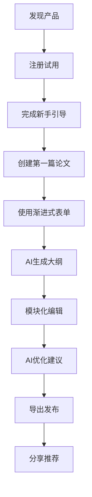
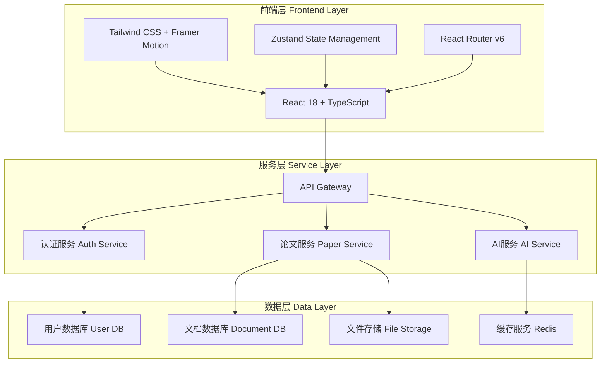

# Essay Pass - AI论文写作助手 产品需求文档(PRD)

**版本**: v1.0  
**更新日期**: 2025-08-02  
**产品名称**: Essay Pass - AI论文写作助手  
**项目代号**: intelligent-progressive-form  

---

## 📋 目录

1. [产品概述](#1-产品概述)
2. [市场分析](#2-市场分析)
3. [用户需求](#3-用户需求)
4. [功能需求](#4-功能需求)
5. [非功能需求](#5-非功能需求)
6. [技术架构](#6-技术架构)
7. [用户体验](#7-用户体验)
8. [产品路线图](#8-产品路线图)
9. [风险评估](#9-风险评估)
10. [成功指标](#10-成功指标)

---

## 1. 产品概述

### 1.1 产品定位
Essay Pass 是一款基于AI技术的智能论文写作助手，通过渐进式表单引导和模块化编辑器，为用户提供从构思到成稿的完整学术写作解决方案。

### 1.2 核心价值主张
- **降低写作门槛**: 通过AI引导，让学术写作变得简单易懂
- **提升写作效率**: 智能大纲生成和内容建议，大幅缩短写作时间
- **保证学术质量**: 多角色AI专家团队，确保论文的学术规范性
- **优化写作体验**: 模块化编辑器和流畅的用户界面，营造专注的写作环境

### 1.3 目标用户
**主要用户群体**:
- 本科生和研究生 (70%)
- 学术研究人员 (20%)
- 专业写作人员 (10%)

**用户特征**:
- 年龄: 18-35岁
- 教育背景: 大专及以上学历
- 技术接受度: 中等至较高
- 写作经验: 有一定学术写作基础但需要指导和优化

### 1.4 使用场景
- **学术论文写作**: 期刊论文、会议论文、学位论文
- **毕业设计**: 本科毕业论文、硕士博士学位论文
- **研究报告**: 课题报告、调研报告、技术报告
- **课程作业**: 课程论文、案例分析、文献综述

---

## 2. 市场分析

### 2.1 市场规模
- **全球学术写作软件市场**: 预计2025年达到12亿美元
- **中国在线教育市场**: 2024年超过4000亿人民币
- **目标细分市场**: 学术写作辅助工具约占5%，约200亿人民币

### 2.2 竞品分析

| 产品 | 优势 | 劣势 | 市场份额 |
|------|------|------|----------|
| Grammarly | 语法检查准确 | 缺乏结构指导 | 35% |
| Notion | 组织能力强 | 学术专业性弱 | 15% |
| LaTeX | 格式化专业 | 学习门槛高 | 20% |
| Overleaf | 协作功能好 | AI辅助不足 | 12% |
| **Essay Pass** | **AI全流程指导** | **新产品** | **目标5%** |

### 2.3 差异化优势
1. **渐进式引导**: 降低学术写作的认知负担
2. **多角色AI助手**: 专业化的写作建议和优化
3. **模块化编辑**: 可视化的论文结构管理
4. **中文优化**: 针对中文学术写作的特殊优化

### 2.4 市场机会
- 在线教育市场快速增长
- AI技术在教育领域的广泛应用
- 疫情推动的线上学习习惯
- 学术发表压力增大带来的市场需求

---

## 3. 用户需求

### 3.1 用户画像

#### 3.1.1 大学生小王 (本科生)
- **基本信息**: 21岁，计算机专业大三学生
- **痛点**: 缺乏学术写作经验，不知道如何开始写论文
- **期望**: 有人能指导论文结构，提供写作建议
- **使用场景**: 毕业论文写作，课程作业

#### 3.1.2 研究生小李 (研究生)
- **基本信息**: 25岁，经济学硕士二年级
- **痛点**: 写作效率低，反复修改浪费时间
- **期望**: 快速生成大纲，获得专业的写作建议
- **使用场景**: 学位论文，期刊论文投稿

#### 3.1.3 研究员老张 (科研人员)
- **基本信息**: 32岁，高校副教授
- **痛点**: 需要频繁写作各类学术文档，格式要求繁琐
- **期望**: 提高写作效率，保证学术规范性
- **使用场景**: 基金申请书，研究报告，论文发表

### 3.2 核心需求分析

#### 3.2.1 功能性需求
1. **写作指导需求** (重要性: ⭐⭐⭐⭐⭐)
   - 论文结构规划
   - 写作技巧指导
   - 内容质量评估

2. **效率提升需求** (重要性: ⭐⭐⭐⭐⭐)
   - 快速大纲生成
   - 智能内容建议
   - 自动格式化

3. **质量保证需求** (重要性: ⭐⭐⭐⭐)
   - 学术规范检查
   - 引用格式规范
   - 逻辑结构优化

#### 3.2.2 情感性需求
1. **信心建立** - 通过AI指导建立写作信心
2. **成就感** - 完成高质量论文的满足感
3. **减压需求** - 降低学术写作的焦虑感

#### 3.2.3 社会性需求
1. **学术认可** - 获得导师和同行的认可
2. **发表成功** - 论文顺利发表或通过答辩
3. **职业发展** - 提升学术写作能力促进职业发展

### 3.3 用户使用路径



---

## 4. 功能需求

### 4.1 核心功能模块

#### 4.1.1 渐进式表单系统
**功能描述**: 通过4步引导式表单，收集用户需求并生成个性化论文结构

**用户故事**:
- 作为学术写作新手，我希望有系统的引导帮助我明确论文需求
- 作为研究生，我希望快速设置论文的基本框架和要求

**功能规格**:

| 步骤 | 功能点 | 必填项 | 选填项 |
|------|--------|--------|--------|
| 步骤1: 基本信息 | 论文标题、类型、领域 | 标题、类型、领域 | 语言、风格 |
| 步骤2: 内容结构 | 大纲偏好、详细程度 | 大纲结构 | 字数要求、特殊要求 |
| 步骤3: 参考文献 | 引用格式、文献管理 | 引用格式 | 参考文献列表 |
| 步骤4: 生成设置 | AI生成选项配置 | 基本设置 | 高级选项 |

**验收标准**:
- [ ] 用户可以顺序完成4个步骤
- [ ] 每步都有输入验证和错误提示
- [ ] 支持步骤间的前进后退导航
- [ ] 表单数据实时保存，防止丢失
- [ ] 移动端适配良好，操作流畅

#### 4.1.2 模块化编辑器系统
**功能描述**: 将论文按章节分解为可视化模块，支持拖拽重组和独立编辑

**用户故事**:
- 作为用户，我希望以模块化的方式管理论文章节
- 作为用户，我希望直观地看到论文的整体结构和进度

**功能规格**:
- **结构导航树**: 左侧树形结构显示论文章节
- **模块卡片**: 每个章节显示为卡片，包含进度、字数、状态
- **拖拽排序**: 支持章节的拖拽重新排序
- **模板库**: 提供多种学术论文模板
- **进度跟踪**: 实时显示写作进度和完成度

**验收标准**:
- [ ] 章节可以通过拖拽重新排序
- [ ] 模块卡片准确显示进度信息
- [ ] 支持章节的增删改操作
- [ ] 模板应用后正确生成章节结构
- [ ] 进度统计准确，实时更新

#### 4.1.3 多角色AI助手系统
**功能描述**: 提供4种专业AI角色，针对不同写作需求提供专业建议

**用户故事**:
- 作为写作者，我希望获得专业的学术写作指导
- 作为研究者，我希望AI能帮助我优化论文的逻辑结构

**AI角色规格**:

| AI角色 | 专业领域 | 主要功能 | 建议类型 |
|--------|----------|----------|----------|
| 学术写作专家 | 语言表达、结构优化 | 语言润色、写作指导 | 句式优化、段落结构 |
| 研究助手 | 研究方法、数据分析 | 方法指导、文献检索 | 研究设计、方法选择 |
| 格式专家 | 排版格式、引用规范 | 格式检查、规范调整 | 引用格式、图表规范 |
| 内容顾问 | 逻辑分析、创新评估 | 内容优化、逻辑梳理 | 论证逻辑、创新点 |

**验收标准**:
- [ ] 4种AI角色功能明确，建议专业
- [ ] 支持自然语言对话交互
- [ ] 建议可直接应用到文档中
- [ ] 响应时间控制在2秒内
- [ ] 支持上下文理解和多轮对话

#### 4.1.4 富文本编辑器
**功能描述**: 支持Markdown语法的专业文档编辑器

**功能规格**:
- **Markdown支持**: 完整支持Markdown语法
- **实时预览**: 分屏显示编辑和预览效果
- **自动保存**: 智能自动保存，防止数据丢失
- **快捷操作**: 丰富的快捷键和工具栏
- **导出功能**: 支持PDF、DOCX、MD等格式导出

**验收标准**:
- [ ] Markdown语法渲染正确
- [ ] 自动保存功能稳定可靠
- [ ] 导出格式符合学术规范
- [ ] 编辑性能良好，无明显卡顿
- [ ] 支持撤销重做操作

### 4.2 辅助功能模块

#### 4.2.1 用户认证系统
- 注册/登录功能
- 用户资料管理
- 权限控制

#### 4.2.2 论文管理系统
- 论文列表查看
- 分类标签管理
- 搜索和筛选

#### 4.2.3 数据同步系统
- 云端数据同步
- 本地缓存机制
- 离线编辑支持

#### 4.2.4 导出分享系统
- 多格式导出
- 在线分享链接
- 版本历史管理

---

## 5. 非功能需求

### 5.1 性能需求

#### 5.1.1 响应时间要求
- **页面加载时间**: 首屏加载 < 3秒
- **操作响应时间**: 用户操作响应 < 1秒
- **AI回复时间**: AI助手回复 < 2秒
- **文档保存时间**: 自动保存 < 0.5秒

#### 5.1.2 并发处理能力
- **同时在线用户**: 支持1000+用户同时在线
- **文档编辑并发**: 支持100+用户同时编辑
- **AI服务并发**: 支持50+用户同时使用AI功能

#### 5.1.3 资源使用优化
- **内存使用**: 浏览器内存占用 < 200MB
- **网络流量**: 页面资源总大小 < 5MB
- **CPU占用**: 编辑器操作CPU占用 < 10%

### 5.2 可用性需求

#### 5.2.1 系统可用性
- **服务可用率**: 99.5%以上
- **故障恢复时间**: 平均 < 4小时
- **数据备份频率**: 每日自动备份

#### 5.2.2 用户体验可用性
- **学习成本**: 新用户10分钟内掌握基本操作
- **错误率**: 用户操作错误率 < 3%
- **满意度**: 用户满意度评分 > 4.0/5.0

### 5.3 安全需求

#### 5.3.1 数据安全
- **数据加密**: 传输和存储数据全程加密
- **隐私保护**: 用户文档内容严格保密
- **访问控制**: 基于角色的权限管理

#### 5.3.2 系统安全
- **身份认证**: 支持多重身份验证
- **攻击防护**: 防SQL注入、XSS等常见攻击
- **安全审计**: 完整的操作日志记录

### 5.4 兼容性需求

#### 5.4.1 浏览器兼容性
- **现代浏览器**: Chrome 90+, Firefox 88+, Safari 14+, Edge 90+
- **移动浏览器**: iOS Safari, Android Chrome
- **兼容性覆盖**: 95%以上的主流浏览器版本

#### 5.4.2 设备兼容性
- **桌面设备**: Windows, macOS, Linux
- **移动设备**: iOS 12+, Android 8+
- **屏幕适配**: 320px - 1920px宽度范围

### 5.5 可扩展性需求

#### 5.5.1 功能扩展性
- **模块化架构**: 支持功能模块的独立部署
- **API设计**: RESTful API支持第三方集成
- **插件系统**: 支持第三方插件扩展

#### 5.5.2 技术扩展性
- **微服务架构**: 支持服务的水平扩展
- **容器化部署**: 支持Docker和Kubernetes
- **云原生设计**: 支持多云部署策略

---

## 6. 技术架构

### 6.1 整体架构设计



### 6.2 前端技术栈

#### 6.2.1 核心框架
- **React 18**: 现代化UI框架，支持并发特性
- **TypeScript**: 静态类型检查，提升代码质量
- **Vite**: 快速构建工具，优化开发体验

#### 6.2.2 状态管理
- **Zustand**: 轻量级状态管理，类型安全
- **React Query**: 服务端状态管理，缓存优化

#### 6.2.3 UI和样式
- **Tailwind CSS**: 实用优先的CSS框架
- **Framer Motion**: 专业的动画解决方案
- **Lucide React**: 现代化图标库

#### 6.2.4 开发工具
- **ESLint + Prettier**: 代码规范和格式化
- **Husky**: Git hooks自动化
- **Jest + Testing Library**: 单元测试框架

### 6.3 后端技术栈

#### 6.3.1 服务端框架
- **Node.js + Express**: 高性能JavaScript运行环境
- **TypeScript**: 全栈类型安全
- **PM2**: 进程管理和负载均衡

#### 6.3.2 数据存储
- **PostgreSQL**: 主数据库，ACID支持
- **Redis**: 缓存和会话存储
- **MongoDB**: 文档存储，适合非结构化数据
- **AWS S3**: 文件存储服务

#### 6.3.3 AI服务
- **OpenAI API**: GPT模型集成
- **Langchain**: LLM应用开发框架
- **Vector Database**: 向量搜索和语义匹配

### 6.4 部署架构

#### 6.4.1 容器化部署
- **Docker**: 应用容器化
- **Kubernetes**: 容器编排和管理
- **Helm**: Kubernetes应用包管理

#### 6.4.2 云服务
- **AWS/阿里云**: 云服务提供商
- **CDN**: 静态资源加速
- **Load Balancer**: 负载均衡

#### 6.4.3 监控运维
- **Prometheus + Grafana**: 监控和可视化
- **ELK Stack**: 日志收集和分析
- **Sentry**: 错误监控和性能分析

### 6.5 数据架构

#### 6.5.1 核心数据模型

```typescript
// 用户模型
interface User {
  id: string;
  email: string;
  name: string;
  avatar?: string;
  createdAt: Date;
  updatedAt: Date;
}

// 论文模型
interface Paper {
  id: string;
  title: string;
  content: string;
  abstract?: string;
  keywords?: string[];
  status: 'draft' | 'writing' | 'completed';
  authorId: string;
  wordCount: number;
  sections: Section[];
  createdAt: Date;
  updatedAt: Date;
}

// 章节模型
interface Section {
  id: string;
  title: string;
  content: string;
  order: number;
  level: number;
  wordCount: number;
}
```

#### 6.5.2 数据流架构
- **单向数据流**: 遵循Redux/Flux模式
- **实时同步**: WebSocket实现实时数据同步
- **离线支持**: IndexedDB本地存储
- **版本控制**: 文档版本历史管理

---

## 7. 用户体验

### 7.1 设计原则

#### 7.1.1 简洁性原则
- **最小化认知负担**: 界面简洁，功能聚焦
- **渐进式披露**: 按需显示功能，避免界面拥挤
- **一致性设计**: 统一的视觉语言和交互模式

#### 7.1.2 易用性原则
- **直觉式操作**: 符合用户习惯的交互方式
- **即时反馈**: 操作结果及时可见
- **容错设计**: 防错提示和错误恢复机制

#### 7.1.3 专业性原则
- **学术规范**: 符合学术写作的专业要求
- **功能完整**: 覆盖学术写作的全流程需求
- **质量保证**: 确保输出内容的专业性

### 7.2 界面设计规范

#### 7.2.1 视觉设计
- **色彩方案**: 
  - 主色调: #3B82F6 (蓝色，专业稳重)
  - 辅助色: #10B981 (绿色，成功状态)
  - 警告色: #F59E0B (黄色，注意事项)
  - 错误色: #EF4444 (红色，错误状态)
- **字体系统**:
  - 主字体: -apple-system, BlinkMacSystemFont, 'PingFang SC'
  - 代码字体: 'JetBrains Mono', 'Fira Code'
- **间距系统**: 基于8px网格的间距体系

#### 7.2.2 组件规范
- **按钮**: 主要按钮、次要按钮、文本按钮三种类型
- **表单**: 输入框、选择器、文本域统一样式
- **卡片**: 阴影、圆角、边框的统一规范
- **图标**: 24px标准尺寸，统一线条粗细

### 7.3 交互设计

#### 7.3.1 导航设计
- **面包屑导航**: 清晰显示用户位置
- **侧边栏导航**: 功能模块快速切换
- **标签页导航**: 多文档管理

#### 7.3.2 反馈设计
- **加载状态**: 骨架屏、进度条、加载动画
- **成功反馈**: Toast提示、状态图标
- **错误处理**: 错误页面、提示信息、重试机制

#### 7.3.3 动效设计
- **页面转场**: 平滑的页面切换动画
- **元素动画**: 悬浮、点击、状态变化动效
- **加载动画**: 有趣的加载状态动画

### 7.4 响应式设计

#### 7.4.1 断点设计
- **Mobile**: < 768px
- **Tablet**: 768px - 1024px  
- **Desktop**: > 1024px

#### 7.4.2 适配策略
- **移动优先**: 从移动端开始设计
- **渐进增强**: 桌面端增加更多功能
- **内容优先**: 确保核心内容在所有设备上可访问

### 7.5 可访问性设计

#### 7.5.1 WCAG 2.1合规
- **AA级别**: 满足WCAG 2.1 AA级别要求
- **键盘导航**: 完整的键盘操作支持
- **屏幕阅读器**: 语义化HTML和ARIA标签

#### 7.5.2 包容性设计
- **色彩对比**: 确保足够的色彩对比度
- **字体大小**: 支持字体缩放
- **操作反馈**: 多模态的操作反馈

---

## 8. 产品路线图

### 8.1 发布计划

#### 8.1.1 MVP版本 (v1.0) - Q3 2025
**核心功能**:
- ✅ 渐进式表单系统
- ✅ 基础模块化编辑器
- ✅ 单一AI助手
- ✅ 基础导出功能

**目标指标**:
- 用户注册: 1,000人
- 日活用户: 100人
- 论文完成: 200篇

#### 8.1.2 功能增强版本 (v1.1) - Q4 2025
**新增功能**:
- 多角色AI助手系统
- 参考文献管理
- 协作编辑功能
- 移动端适配

**目标指标**:
- 用户注册: 5,000人
- 日活用户: 500人
- 论文完成: 1,000篇

#### 8.1.3 专业版本 (v1.2) - Q1 2026
**新增功能**:
- 高级模板库
- 数据分析功能
- API开放平台
- 企业版功能

**目标指标**:
- 用户注册: 10,000人
- 日活用户: 1,000人
- 付费用户: 500人

### 8.2 功能优先级

#### 8.2.1 高优先级功能 (P0)
1. 用户认证和数据安全
2. 渐进式表单核心流程
3. 基础编辑器功能
4. AI助手基础对话

#### 8.2.2 中优先级功能 (P1)
1. 多角色AI助手
2. 模块化编辑器
3. 导出分享功能
4. 移动端兼容

#### 8.2.3 低优先级功能 (P2)
1. 高级模板系统
2. 协作编辑功能
3. 数据分析统计
4. 第三方集成

### 8.3 技术债务管理

#### 8.3.1 代码质量
- 代码覆盖率: 目标90%以上
- 技术债务比例: 控制在10%以内
- 性能监控: 持续性能优化

#### 8.3.2 架构演进
- 微服务拆分: 逐步服务化改造
- 云原生转型: 容器化和云原生部署
- 国际化支持: 多语言和多地区支持

---

## 9. 风险评估

### 9.1 技术风险

#### 9.1.1 AI服务依赖风险
**风险描述**: 依赖第三方AI服务可能面临服务不稳定、成本上升等问题

**影响程度**: 高
**发生概率**: 中等

**应对策略**:
- 多AI服务供应商备份方案
- 本地AI能力建设规划
- 成本控制和预算管理

#### 9.1.2 性能扩展性风险
**风险描述**: 用户量快速增长可能导致系统性能瓶颈

**影响程度**: 中等
**发生概率**: 中等

**应对策略**:
- 云服务弹性扩容机制
- 性能监控和预警系统
- 架构优化和服务拆分

#### 9.1.3 数据安全风险
**风险描述**: 用户学术文档泄露或丢失

**影响程度**: 高
**发生概率**: 低

**应对策略**:
- 端到端加密技术
- 多重数据备份机制
- 安全审计和合规检查

### 9.2 市场风险

#### 9.2.1 竞争风险
**风险描述**: 大厂推出类似产品，竞争加剧

**影响程度**: 高
**发生概率**: 高

**应对策略**:
- 差异化功能定位
- 用户粘性建设
- 快速迭代和创新

#### 9.2.2 需求变化风险
**风险描述**: 用户需求快速变化，产品方向偏离

**影响程度**: 中等
**发生概率**: 中等

**应对策略**:
- 用户反馈收集机制
- 敏捷开发和快速调整
- 市场趋势持续监控

#### 9.2.3 合规风险
**风险描述**: 教育行业政策变化影响产品运营

**影响程度**: 中等
**发生概率**: 低

**应对策略**:
- 政策法规持续跟踪
- 合规性设计和审查
- 应急预案制定

### 9.3 运营风险

#### 9.3.1 团队能力风险
**风险描述**: 团队规模和能力无法支撑产品发展

**影响程度**: 高
**发生概率**: 中等

**应对策略**:
- 关键岗位人才储备
- 团队能力建设计划
- 外部合作和资源整合

#### 9.3.2 资金风险
**风险描述**: 产品盈利模式不清晰，资金链紧张

**影响程度**: 高
**发生概率**: 中等

**应对策略**:
- 多元化收入模式探索
- 成本控制和效率优化
- 融资计划制定

#### 9.3.3 用户增长风险
**风险描述**: 用户获取成本高，增长缓慢

**影响程度**: 中等
**发生概率**: 中等

**应对策略**:
- 多渠道获客策略
- 产品口碑营销
- 用户推荐激励机制

---

## 10. 成功指标

### 10.1 业务指标

#### 10.1.1 用户增长指标
- **用户注册量**: 月增长率 > 20%
- **日活用户(DAU)**: 目标1,000人 (6个月内)
- **月活用户(MAU)**: 目标5,000人 (6个月内)
- **用户留存率**: 
  - 次日留存 > 40%
  - 7日留存 > 25%
  - 30日留存 > 15%

#### 10.1.2 使用行为指标
- **论文完成率**: > 60% (开始创建到完成导出)
- **平均使用时长**: > 30分钟/会话
- **功能使用率**:
  - 渐进式表单完成率 > 80%
  - AI助手使用率 > 50%
  - 导出功能使用率 > 70%

#### 10.1.3 收入指标
- **付费转化率**: > 5% (注册用户转付费用户)
- **ARPU**(平均每用户收入): > ¥50/月
- **LTV**(用户生命周期价值): > ¥300

### 10.2 产品质量指标

#### 10.2.1 性能指标
- **页面加载时间**: < 3秒
- **API响应时间**: < 1秒
- **系统可用率**: > 99.5%
- **错误率**: < 0.1%

#### 10.2.2 用户体验指标
- **用户满意度**: > 4.0/5.0 (用户评分)
- **NPS净推荐值**: > 50
- **客服工单量**: < 2% (用户比例)
- **功能易用性评分**: > 4.0/5.0

#### 10.2.3 内容质量指标
- **AI建议采纳率**: > 40%
- **论文质量评分**: > 4.0/5.0 (用户自评)
- **格式规范符合率**: > 95%

### 10.3 技术指标

#### 10.3.1 开发效率指标
- **迭代周期**: 2周/迭代
- **功能上线成功率**: > 95%
- **Bug修复时间**: < 2天 (平均)
- **代码覆盖率**: > 80%

#### 10.3.2 运维指标
- **部署成功率**: > 99%
- **监控覆盖率**: > 95%
- **安全事件**: 0次重大安全事件
- **数据备份成功率**: 100%

### 10.4 市场指标

#### 10.4.1 品牌认知指标
- **品牌知名度**: 目标学术群体认知度 > 10%
- **搜索排名**: "AI论文写作"关键词前5位
- **媒体报道**: 10+篇专业媒体报道
- **用户推荐率**: > 30%

#### 10.4.2 竞争指标
- **市场份额**: 细分市场份额 > 5%
- **功能对比优势**: 核心功能领先竞品
- **用户流失到竞品比例**: < 10%

### 10.5 数据监控体系

#### 10.5.1 实时监控
- **用户行为埋点**: 全链路用户行为追踪
- **性能监控**: 实时性能指标监控
- **异常告警**: 自动异常检测和告警

#### 10.5.2 定期分析
- **周报**: 核心指标周度回顾
- **月报**: 全面业务数据月度分析
- **季报**: 战略目标达成情况季度评估

#### 10.5.3 数据决策
- **A/B测试**: 功能优化的数据验证
- **用户访谈**: 定性数据补充定量分析
- **竞品分析**: 市场变化趋势跟踪

---

## 📊 附录

### A. 术语表

| 术语 | 定义 |
|------|------|
| PRD | Product Requirement Document，产品需求文档 |
| MVP | Minimum Viable Product，最小可行产品 |
| AI | Artificial Intelligence，人工智能 |
| UX/UI | User Experience/User Interface，用户体验/用户界面 |
| API | Application Programming Interface，应用程序接口 |
| SLA | Service Level Agreement，服务水平协议 |
| KPI | Key Performance Indicator，关键绩效指标 |
| DAU/MAU | Daily/Monthly Active Users，日活/月活用户 |
| ARPU | Average Revenue Per User，平均每用户收入 |
| LTV | Life Time Value，用户生命周期价值 |
| NPS | Net Promoter Score，净推荐值 |

### B. 参考文档

1. 《产品经理手册》- Marty Cagan
2. 《用户体验要素》- Jesse James Garrett  
3. 《精益创业》- Eric Ries
4. 《增长黑客》- Sean Ellis
5. React 官方文档: https://react.dev
6. TypeScript 官方文档: https://typescriptlang.org
7. Tailwind CSS 文档: https://tailwindcss.com

### C. 版本历史

| 版本 | 日期 | 更新内容 | 更新人 |
|------|------|----------|--------|
| v1.0 | 2025-08-02 | 初始版本，完整PRD文档 | Claude |

---

**文档结束**

*本PRD文档基于Essay Pass项目的实际代码实现和流程图分析生成，为产品的持续迭代和优化提供指导。*