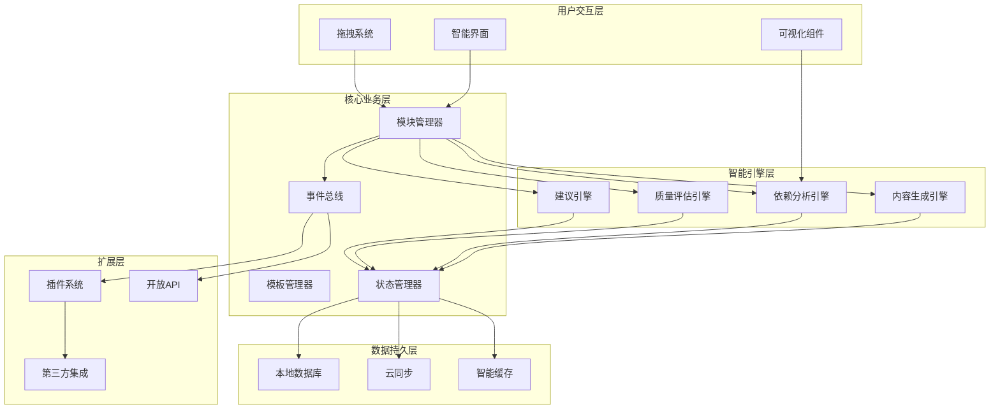
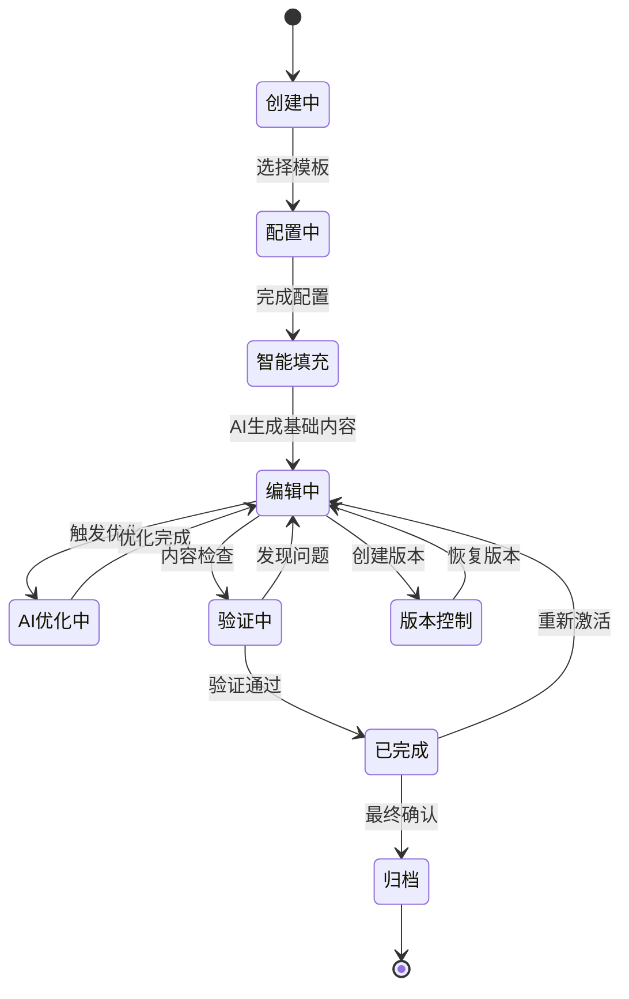
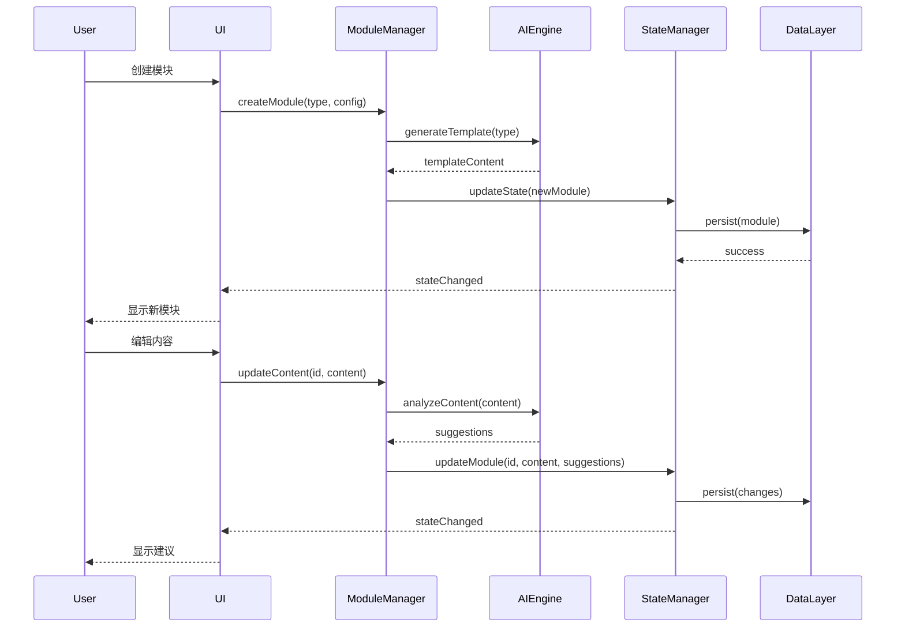
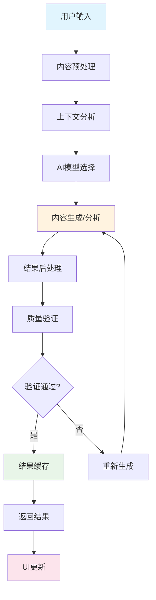

# 智能化模块化编辑器 - 概念图和数据结构

## 1. 系统概念图

### 1.1 整体架构概念图



### 1.2 智能模块生命周期图



### 1.3 依赖关系网络图

```mermaid
graph LR
    subgraph "论文结构"
        Abstract[摘要]
        Intro[引言]
        LitRev[文献综述]
        Method[研究方法]
        Results[研究结果]
        Discussion[讨论]
        Conclusion[结论]
        References[参考文献]
    end
    
    Abstract -.-> Intro : 概念继承
    Intro --> LitRev : 问题引出
    LitRev --> Method : 方法选择
    Method --> Results : 数据产生
    Results --> Discussion : 结果解释
    Discussion --> Conclusion : 结论得出
    
    LitRev -.-> References : 引用依赖
    Method -.-> References : 引用依赖
    Results -.-> References : 引用依赖
    Discussion -.-> References : 引用依赖
    
    Method -.-> Results : 数据流依赖
    Results -.-> Discussion : 分析依赖
    Discussion -.-> Conclusion : 逻辑依赖
    
    style Abstract fill:#ff9999
    style Intro fill:#99ccff
    style LitRev fill:#99ff99
    style Method fill:#ffcc99
    style Results fill:#cc99ff
    style Discussion fill:#ffff99
    style Conclusion fill:#ff99cc
    style References fill:#cccccc
```

## 2. 核心数据结构

### 2.1 智能模块数据结构

```typescript
interface IntelligentModule {
  // === 基础标识 ===
  id: string;
  type: IntelligentModuleType;
  name: string;
  description: string;
  version: string;
  createdAt: Date;
  updatedAt: Date;
  
  // === 内容数据 ===
  content: {
    raw: string;                    // 原始内容
    structured: StructuredContent;   // 结构化内容
    metadata: ContentMetadata;       // 内容元数据
    versions: ContentVersion[];      // 版本历史
    annotations: Annotation[];       // 注释和标记
  };
  
  // === 智能属性 ===
  intelligence: {
    aiGenerated: boolean;           // 是否AI生成
    confidence: number;             // AI置信度 (0-1)
    suggestions: AISuggestion[];    // AI建议列表
    learningData: LearningData;     // 学习数据
    optimizationHistory: OptimizationRecord[]; // 优化历史
  };
  
  // === 依赖关系 ===
  dependencies: {
    structural: StructuralDependency[];  // 结构依赖
    semantic: SemanticDependency[];      // 语义依赖
    citation: CitationDependency[];      // 引用依赖
    data: DataDependency[];              // 数据依赖
  };
  
  // === 状态管理 ===
  state: {
    lifecycle: LifecycleStage;      // 生命周期阶段
    progress: ProgressState;        // 进度状态
    quality: QualityState;          // 质量状态
    validation: ValidationState;    // 验证状态
    editing: EditingState;          // 编辑状态
  };
  
  // === 配置选项 ===
  configuration: {
    template: IntelligentModuleTemplate; // 使用的模板
    aiSettings: AISettings;              // AI设置
    userPreferences: UserPreferences;    // 用户偏好
    displaySettings: DisplaySettings;    // 显示设置
  };
  
  // === 统计信息 ===
  statistics: {
    wordCount: number;              // 字数统计
    characterCount: number;         // 字符统计
    paragraphCount: number;         // 段落统计
    editingTime: number;            // 编辑时间（分钟）
    revisionCount: number;          // 修订次数
    qualityScore: number;           // 质量分数
  };
  
  // === 协作数据 ===
  collaboration: {
    contributors: Contributor[];     // 贡献者
    comments: Comment[];            // 评论
    changes: Change[];              // 变更记录
    permissions: Permission[];       // 权限设置
  };
}

// 模块类型定义
interface IntelligentModuleType {
  id: string;
  category: ModuleCategory;
  name: string;
  description: string;
  icon: string;
  color: string;
  
  // 能力定义
  capabilities: {
    aiGeneration: boolean;          // 支持AI生成
    smartSuggestions: boolean;      // 支持智能建议
    dependencyTracking: boolean;    // 支持依赖跟踪
    qualityAssessment: boolean;     // 支持质量评估
  };
  
  // 结构要求
  structure: {
    requiredSections: Section[];    // 必需部分
    optionalSections: Section[];    // 可选部分
    minLength: number;              // 最小长度
    maxLength: number;              // 最大长度
  };
  
  // 依赖规则
  dependencyRules: {
    requiredPredecessors: string[]; // 必需的前置模块
    optionalPredecessors: string[]; // 可选的前置模块
    blockedSuccessors: string[];    // 禁止的后续模块
  };
}
```

### 2.2 依赖关系数据结构

```typescript
// 基础依赖接口
interface BaseDependency {
  id: string;
  sourceModuleId: string;
  targetModuleId: string;
  type: DependencyType;
  strength: number;               // 依赖强度 (0-1)
  bidirectional: boolean;
  createdAt: Date;
  updatedAt: Date;
  
  // 验证信息
  validation: {
    isValid: boolean;
    lastValidated: Date;
    errors: ValidationError[];
    warnings: ValidationWarning[];
  };
  
  // 智能属性
  intelligence: {
    autoDetected: boolean;        // 是否自动检测
    confidence: number;           // 检测置信度
    suggestedBy: 'user' | 'ai' | 'system';
  };
}

// 结构依赖 - 基于论文结构的逻辑顺序
interface StructuralDependency extends BaseDependency {
  type: 'structural';
  structuralType: 'sequence' | 'hierarchy' | 'inclusion';
  order: number;                  // 排序权重
  flexibility: number;            // 顺序灵活性 (0-1)
}

// 语义依赖 - 基于内容语义的关系
interface SemanticDependency extends BaseDependency {
  type: 'semantic';
  semanticType: 'concept' | 'argument' | 'evidence' | 'method';
  concepts: string[];             // 相关概念
  relationshipType: 'supports' | 'contradicts' | 'extends' | 'explains';
  contextualRelevance: number;    // 上下文相关性 (0-1)
}

// 引用依赖 - 基于文献和图表引用
interface CitationDependency extends BaseDependency {
  type: 'citation';
  citationType: 'literature' | 'figure' | 'table' | 'equation' | 'section';
  citationId: string;             // 引用ID
  citationText: string;           // 引用文本
  pageNumber?: number;            // 页码（如适用）
}

// 数据依赖 - 基于数据流转的关系
interface DataDependency extends BaseDependency {
  type: 'data';
  dataType: 'input' | 'output' | 'transformation' | 'analysis';
  dataIdentifier: string;         // 数据标识
  transformationType?: string;    // 转换类型
  analysisMethod?: string;        // 分析方法
}
```

### 2.3 AI智能系统数据结构

```typescript
// AI建议系统
interface AISuggestion {
  id: string;
  moduleId: string;
  type: SuggestionType;
  category: SuggestionCategory;
  title: string;
  description: string;
  
  // 建议内容
  content: {
    originalText?: string;        // 原始文本
    suggestedText: string;        // 建议文本
    explanation: string;          // 解释说明
    examples?: string[];          // 示例
  };
  
  // 建议属性
  properties: {
    priority: 'low' | 'medium' | 'high' | 'critical';
    confidence: number;           // 置信度 (0-1)
    impact: 'minor' | 'moderate' | 'major';
    effort: 'low' | 'medium' | 'high'; // 实施难度
  };
  
  // 状态管理
  state: {
    status: 'pending' | 'applied' | 'dismissed' | 'archived';
    appliedAt?: Date;
    dismissedAt?: Date;
    userFeedback?: UserFeedback;
  };
  
  // 上下文信息
  context: {
    triggerEvent: string;         // 触发事件
    relatedModules: string[];     // 相关模块
    environmentFactors: string[]; // 环境因素
  };
  
  createdAt: Date;
  updatedAt: Date;
}

// 内容生成配置
interface ContentGenerationConfig {
  model: string;                  // AI模型名称
  temperature: number;            // 创造性参数
  maxTokens: number;              // 最大token数
  
  // 生成策略
  strategy: {
    approach: 'incremental' | 'complete' | 'outline-first';
    style: WritingStyle;
    tone: WritingTone;
    complexity: 'simple' | 'moderate' | 'complex';
  };
  
  // 上下文配置
  context: {
    useModuleHistory: boolean;    // 使用模块历史
    useDependencies: boolean;     // 使用依赖信息
    useResearchData: boolean;     // 使用研究数据
    contextWindow: number;        // 上下文窗口大小
  };
  
  // 质量控制
  quality: {
    enableFactChecking: boolean;  // 启用事实检查
    enablePlagiarismCheck: boolean; // 启用抄袭检查
    enableStyleConsistency: boolean; // 启用风格一致性
  };
}

// 质量评估结果
interface QualityAssessment {
  moduleId: string;
  overallScore: number;           // 总体分数 (0-100)
  
  // 详细评分
  scores: {
    content: number;              // 内容质量
    structure: number;            // 结构质量
    clarity: number;              // 清晰度
    coherence: number;            // 连贯性
    academic: number;             // 学术性
    originality: number;          // 原创性
  };
  
  // 具体问题
  issues: {
    grammar: GrammarIssue[];      // 语法问题
    style: StyleIssue[];          // 风格问题
    structure: StructureIssue[];  // 结构问题
    content: ContentIssue[];      // 内容问题
  };
  
  // 改进建议
  improvements: {
    priority: 'high' | 'medium' | 'low';
    category: string;
    description: string;
    suggestedAction: string;
    estimatedImpact: number;      // 预期影响 (0-1)
  }[];
  
  assessedAt: Date;
  assessmentVersion: string;
}
```

### 2.4 用户交互数据结构

```typescript
// 编辑器状态
interface EditorState {
  // 文档信息
  document: {
    id: string;
    title: string;
    type: DocumentType;
    metadata: DocumentMetadata;
  };
  
  // 模块状态
  modules: {
    items: Map<string, IntelligentModule>;
    order: string[];              // 模块顺序
    selection: {
      selectedIds: Set<string>;   // 选中的模块ID
      activeId: string | null;    // 活动模块ID
      multiSelect: boolean;       // 是否多选模式
    };
  };
  
  // 依赖关系
  dependencies: {
    items: Map<string, ModuleDependency>;
    graph: DependencyGraph;       // 依赖图
    visualization: {
      layout: 'hierarchical' | 'force' | 'circular';
      showTypes: DependencyType[];
      highlightPath: string[];    // 高亮路径
    };
  };
  
  // UI状态
  ui: {
    layout: {
      leftSidebar: {
        width: number;
        collapsed: boolean;
        activeTab: string;
      };
      rightSidebar: {
        width: number;
        collapsed: boolean;
        activeTab: string;
      };
      mainArea: {
        viewMode: 'canvas' | 'list' | 'outline';
        zoomLevel: number;
        panOffset: { x: number; y: number };
      };
    };
    
    interaction: {
      dragState: DragState | null;
      editingModule: string | null;
      contextMenu: ContextMenuState | null;
      notifications: Notification[];
    };
  };
  
  // AI状态
  ai: {
    processing: {
      isGenerating: boolean;
      isAnalyzing: boolean;
      currentTask: AITask | null;
      progress: number;           // 进度 (0-1)
    };
    
    suggestions: {
      items: Map<string, AISuggestion[]>;
      visible: boolean;
      filters: SuggestionFilter[];
    };
    
    cache: {
      responses: Map<string, AIResponse>;
      analyses: Map<string, AnalysisResult>;
      lastCleanup: Date;
    };
  };
  
  // 用户会话
  session: {
    startTime: Date;
    lastActivity: Date;
    actions: UserAction[];        // 用户操作历史
    statistics: SessionStatistics;
  };
}

// 拖拽状态
interface DragState {
  draggedItem: {
    type: 'module' | 'dependency';
    id: string;
    element: HTMLElement;
  };
  
  dragPreview: {
    visible: boolean;
    position: { x: number; y: number };
    content: string;
  };
  
  dropZones: {
    valid: DropZone[];
    invalid: DropZone[];
    highlighted: string | null;
  };
  
  ghost: {
    element: HTMLElement | null;
    opacity: number;
  };
}

// 上下文菜单状态
interface ContextMenuState {
  visible: boolean;
  position: { x: number; y: number };
  targetType: 'module' | 'dependency' | 'canvas';
  targetId: string | null;
  
  items: ContextMenuItem[];
}

interface ContextMenuItem {
  id: string;
  label: string;
  icon?: string;
  action: () => void;
  disabled?: boolean;
  shortcut?: string;
  submenu?: ContextMenuItem[];
}
```

### 2.5 扩展系统数据结构

```typescript
// 插件定义
interface ModulePlugin {
  // 插件元信息
  metadata: {
    id: string;
    name: string;
    version: string;
    author: string;
    description: string;
    homepage?: string;
    repository?: string;
  };
  
  // 依赖信息
  dependencies: {
    editorVersion: string;        // 编辑器版本要求
    plugins: PluginDependency[];  // 插件依赖
    libraries: LibraryDependency[]; // 库依赖
  };
  
  // 插件能力
  capabilities: {
    moduleTypes: string[];        // 支持的模块类型
    aiEnhancements: string[];     // AI增强功能
    uiExtensions: string[];       // UI扩展
    dataProcessors: string[];     // 数据处理器
  };
  
  // 配置选项
  configuration: {
    settings: PluginSetting[];    // 配置项
    defaults: Record<string, any>; // 默认值
    schema: JSONSchema;           // 配置模式
  };
  
  // 生命周期钩子
  hooks: {
    onInstall?: () => Promise<void>;
    onUninstall?: () => Promise<void>;
    onActivate?: () => Promise<void>;
    onDeactivate?: () => Promise<void>;
    
    // 编辑器事件钩子
    onModuleCreate?: (module: IntelligentModule) => void;
    onModuleUpdate?: (module: IntelligentModule, changes: any) => void;
    onModuleDelete?: (moduleId: string) => void;
    onDependencyChange?: (dependency: ModuleDependency) => void;
  };
  
  // 扩展点
  extensions: {
    moduleTypes?: ModuleTypeExtension[];
    uiComponents?: UIComponentExtension[];
    aiProviders?: AIProviderExtension[];
    dataProcessors?: DataProcessorExtension[];
  };
}

// 模块类型扩展
interface ModuleTypeExtension {
  type: IntelligentModuleType;
  templates: IntelligentModuleTemplate[];
  renderer: ComponentType<ModuleRendererProps>;
  editor: ComponentType<ModuleEditorProps>;
  validator: (module: IntelligentModule) => ValidationResult;
}

// API接口定义
interface EditorAPI {
  // 版本信息
  version: string;
  
  // 模块操作
  modules: {
    create(type: string, config?: ModuleConfig): Promise<string>;
    get(id: string): Promise<IntelligentModule | null>;
    update(id: string, updates: Partial<IntelligentModule>): Promise<void>;
    delete(id: string): Promise<void>;
    list(filter?: ModuleFilter): Promise<IntelligentModule[]>;
    reorder(sequence: string[]): Promise<void>;
  };
  
  // 依赖操作
  dependencies: {
    create(dependency: DependencyInput): Promise<string>;
    get(id: string): Promise<ModuleDependency | null>;
    update(id: string, updates: Partial<ModuleDependency>): Promise<void>;
    delete(id: string): Promise<void>;
    list(filter?: DependencyFilter): Promise<ModuleDependency[]>;
    analyze(): Promise<DependencyAnalysis>;
  };
  
  // AI服务
  ai: {
    generateContent(request: ContentGenerationRequest): Promise<string>;
    analyzeDependencies(): Promise<DependencyAnalysis>;
    getSuggestions(moduleId: string): Promise<AISuggestion[]>;
    assessQuality(moduleId: string): Promise<QualityAssessment>;
  };
  
  // 事件系统
  events: {
    subscribe<T>(event: string, callback: (data: T) => void): () => void;
    emit<T>(event: string, data: T): void;
    once<T>(event: string, callback: (data: T) => void): () => void;
  };
  
  // 配置管理
  config: {
    get<T>(key: string): T | undefined;
    set<T>(key: string, value: T): Promise<void>;
    delete(key: string): Promise<void>;
    list(): Promise<Record<string, any>>;
  };
  
  // 插件管理
  plugins: {
    install(plugin: ModulePlugin): Promise<void>;
    uninstall(pluginId: string): Promise<void>;
    activate(pluginId: string): Promise<void>;
    deactivate(pluginId: string): Promise<void>;
    list(): Promise<PluginInfo[]>;
  };
}
```

## 3. 数据流图

### 3.1 用户操作数据流



### 3.2 AI处理数据流



这个概念图和数据结构设计提供了智能化模块化编辑器的完整技术蓝图，包括了系统架构、数据模型、AI集成和扩展机制的详细定义。