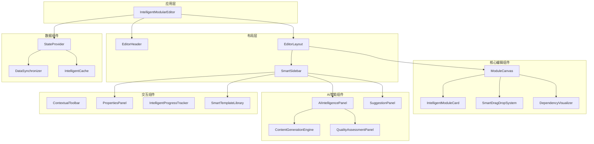

# 智能化模块化编辑器 - 组件设计与实现方案

## 1. 组件架构设计

### 1.1 组件层次结构



### 1.2 组件职责矩阵

| 组件 | 主要职责 | 智能特性 | 交互能力 |
|------|----------|----------|----------|
| IntelligentModularEditor | 整体协调、状态管理 | 自适应布局、智能推荐 | 键盘快捷键、手势 |
| ModuleCanvas | 模块展示、空间管理 | 智能布局、自动对齐 | 拖拽、缩放、平移 |
| IntelligentModuleCard | 单模块显示编辑 | AI内容生成、实时建议 | 内联编辑、上下文菜单 |
| SmartDragDropSystem | 拖拽操作管理 | 智能放置预测、约束检查 | 多点触控、手势识别 |
| DependencyVisualizer | 依赖关系可视化 | 自动布局、关系预测 | 交互式探索、筛选 |
| AIIntelligencePanel | AI功能集成 | 多模型协调、结果融合 | 对话式交互、批量操作 |
| SuggestionPanel | 建议展示管理 | 优先级排序、个性化推荐 | 快速操作、批量处理 |
| SmartTemplateLibrary | 模板管理 | 智能推荐、自适应模板 | 预览、快速应用 |

## 2. 核心组件详细设计

### 2.1 IntelligentModularEditor 主编辑器

```typescript
interface IntelligentModularEditorProps {
  documentId: string;
  initialConfig?: EditorConfig;
  onStateChange?: (state: EditorState) => void;
  plugins?: ModulePlugin[];
}

const IntelligentModularEditor: React.FC<IntelligentModularEditorProps> = ({
  documentId,
  initialConfig,
  onStateChange,
  plugins = []
}) => {
  // === 状态管理 ===
  const [editorState, setEditorState] = useImmer<EditorState>(initialState);
  const [aiState, setAIState] = useImmer<AIState>({
    isProcessing: false,
    suggestions: new Map(),
    analysisResults: new Map()
  });
  
  // === Hooks 集成 ===
  const { 
    generateContent, 
    analyzeContent, 
    getSuggestions 
  } = useAIIntegration();
  
  const {
    optimizeLayout,
    trackPerformance,
    memoizedRendering
  } = useEditorOptimization();
  
  const {
    handleDragStart,
    handleDragEnd,
    validateDrop
  } = useIntelligentDragDrop();
  
  // === 智能特性 ===
  const intelligentFeatures = useMemo(() => ({
    // 自适应布局
    adaptiveLayout: {
      calculateOptimalLayout: (modules: IntelligentModule[]) => {
        // 基于模块数量、屏幕尺寸、用户偏好计算最佳布局
        const screenSize = { width: window.innerWidth, height: window.innerHeight };
        const moduleCount = modules.length;
        const userPreference = editorState.ui.layout.preference;
        
        return optimizeLayout(modules, screenSize, userPreference);
      },
      
      adjustToContent: (module: IntelligentModule) => {
        // 根据内容调整模块大小
        const contentComplexity = analyzeContentComplexity(module.content.raw);
        return calculateOptimalSize(contentComplexity);
      }
    },
    
    // 智能建议系统
    suggestionSystem: {
      generateContextualSuggestions: async (moduleId: string) => {
        const module = editorState.modules.items.get(moduleId);
        if (!module) return [];
        
        const context = {
          currentModule: module,
          relatedModules: getRelatedModules(module),
          documentContext: getDocumentContext()
        };
        
        return await getSuggestions(context);
      },
      
      prioritizeSuggestions: (suggestions: AISuggestion[]) => {
        return suggestions.sort((a, b) => {
          // 基于置信度、影响度、用户偏好排序
          const scoreA = calculateSuggestionScore(a);
          const scoreB = calculateSuggestionScore(b);
          return scoreB - scoreA;
        });
      }
    },
    
    // 性能优化
    performanceOptimization: {
      virtualizeRendering: moduleCount > 20,
      lazyLoadComponents: true,
      debounceUpdates: 300,
      memoizeExpensiveOperations: true
    }
  }), [editorState.modules.items]);
  
  // === 事件处理 ===
  const handleModuleCreate = useCallback(async (
    type: IntelligentModuleType,
    config?: ModuleConfig
  ) => {
    const newModule = await createIntelligentModule(type, config);
    const optimalPosition = intelligentFeatures.adaptiveLayout
      .calculateOptimalPosition(newModule);
    
    setEditorState(draft => {
      draft.modules.items.set(newModule.id, {
        ...newModule,
        position: optimalPosition
      });
      draft.modules.order.push(newModule.id);
    });
    
    // 触发AI内容生成
    if (config?.autoGenerate) {
      handleContentGeneration(newModule.id, config.generationPrompt);
    }
  }, [intelligentFeatures.adaptiveLayout]);
  
  const handleModuleUpdate = useCallback(async (
    moduleId: string,
    updates: Partial<IntelligentModule>
  ) => {
    setEditorState(draft => {
      const module = draft.modules.items.get(moduleId);
      if (module) {
        Object.assign(module, updates);
        module.updatedAt = new Date();
        
        // 更新统计信息
        if (updates.content?.raw) {
          updateModuleStatistics(module, updates.content.raw);
        }
      }
    });
    
    // 触发智能分析
    if (updates.content?.raw) {
      const analysisResult = await analyzeContent(updates.content.raw);
      setAIState(draft => {
        draft.analysisResults.set(moduleId, analysisResult);
      });
      
      // 生成上下文建议
      const suggestions = await intelligentFeatures.suggestionSystem
        .generateContextualSuggestions(moduleId);
      setAIState(draft => {
        draft.suggestions.set(moduleId, suggestions);
      });
    }
  }, [analyzeContent, intelligentFeatures.suggestionSystem]);
  
  const handleContentGeneration = useCallback(async (
    moduleId: string,
    prompt: string
  ) => {
    setAIState(draft => {
      draft.isProcessing = true;
    });
    
    try {
      const module = editorState.modules.items.get(moduleId);
      if (!module) return;
      
      const context = {
        moduleType: module.type,
        existingContent: module.content.raw,
        relatedModules: getRelatedModules(module),
        documentGoals: getDocumentGoals()
      };
      
      const generatedContent = await generateContent(prompt, context);
      
      await handleModuleUpdate(moduleId, {
        content: {
          ...module.content,
          raw: generatedContent,
          metadata: {
            ...module.content.metadata,
            aiGenerated: true,
            generationTimestamp: new Date()
          }
        },
        intelligence: {
          ...module.intelligence,
          aiGenerated: true,
          confidence: 0.85 // 从AI响应中获取
        }
      });
    } catch (error) {
      console.error('Content generation failed:', error);
      // 显示错误提示
    } finally {
      setAIState(draft => {
        draft.isProcessing = false;
      });
    }
  }, [editorState.modules.items, generateContent, handleModuleUpdate]);
  
  // === 渲染 ===
  return (
    <EditorStateProvider value={editorState}>
      <AIStateProvider value={aiState}>
        <div className="intelligent-modular-editor">
          <EditorHeader
            document={editorState.document}
            onAction={handleHeaderAction}
            showProgress={true}
          />
          
          <EditorLayout
            leftSidebar={
              <SmartSidebar
                position="left"
                tabs={leftSidebarTabs}
                onTabChange={setLeftSidebarTab}
              />
            }
            
            rightSidebar={
              <SmartSidebar
                position="right"
                tabs={rightSidebarTabs}
                onTabChange={setRightSidebarTab}
              />
            }
            
            mainContent={
              <ModuleCanvas
                modules={Array.from(editorState.modules.items.values())}
                layout={editorState.ui.layout.mainArea}
                onModuleCreate={handleModuleCreate}
                onModuleUpdate={handleModuleUpdate}
                onModuleDelete={handleModuleDelete}
                onModuleSelect={handleModuleSelect}
                dragDropSystem={
                  <SmartDragDropSystem
                    onDragStart={handleDragStart}
                    onDragEnd={handleDragEnd}
                    validateDrop={validateDrop}
                  />
                }
              />
            }
          />
          
          <ContextualToolbar
            selectedModules={editorState.modules.selection.selectedIds}
            context={getCurrentContext()}
            onAction={handleToolbarAction}
          />
          
          <NotificationSystem
            notifications={editorState.ui.interaction.notifications}
            onDismiss={handleNotificationDismiss}
          />
        </div>
      </AIStateProvider>
    </EditorStateProvider>
  );
};
```

### 2.2 IntelligentModuleCard 智能模块卡片

```typescript
interface IntelligentModuleCardProps {
  module: IntelligentModule;
  isSelected: boolean;
  isEditing: boolean;
  layout: 'card' | 'compact' | 'expanded';
  onUpdate: (updates: Partial<IntelligentModule>) => void;
  onSelect: (moduleId: string) => void;
  onEdit: (moduleId: string) => void;
}

const IntelligentModuleCard: React.FC<IntelligentModuleCardProps> = ({
  module,
  isSelected,
  isEditing,
  layout,
  onUpdate,
  onSelect,
  onEdit
}) => {
  // === 智能特性状态 ===
  const [aiSuggestions, setAISuggestions] = useState<AISuggestion[]>([]);
  const [qualityScore, setQualityScore] = useState<number>(0);
  const [isAnalyzing, setIsAnalyzing] = useState(false);
  
  // === 内容编辑状态 ===
  const [content, setContent] = useState(module.content.raw);
  const [editorMode, setEditorMode] = useState<'rich' | 'markdown' | 'wysiwyg'>('rich');
  
  // === Hooks ===
  const { 
    analyzeContent, 
    generateSuggestions,
    assessQuality 
  } = useAIFeatures();
  
  const {
    trackUserInteraction,
    optimizeRendering
  } = useModuleOptimization();
  
  const debouncedAnalysis = useDebounce(
    async (content: string) => {
      setIsAnalyzing(true);
      try {
        const [suggestions, quality] = await Promise.all([
          generateSuggestions(content, module.type),
          assessQuality(content, module.configuration.template)
        ]);
        
        setAISuggestions(suggestions);
        setQualityScore(quality.overallScore);
      } catch (error) {
        console.error('Analysis failed:', error);
      } finally {
        setIsAnalyzing(false);
      }
    },
    500
  );
  
  // === 智能内容处理 ===
  const handleContentChange = useCallback((newContent: string) => {
    setContent(newContent);
    
    // 实时统计更新
    const statistics = calculateContentStatistics(newContent);
    
    onUpdate({
      content: {
        ...module.content,
        raw: newContent,
        metadata: {
          ...module.content.metadata,
          lastModified: new Date()
        }
      },
      statistics: {
        ...module.statistics,
        ...statistics
      }
    });
    
    // 触发智能分析
    debouncedAnalysis(newContent);
    
    // 记录用户交互
    trackUserInteraction('content_edit', {
      moduleId: module.id,
      changeLength: Math.abs(newContent.length - content.length)
    });
  }, [module, content, onUpdate, debouncedAnalysis, trackUserInteraction]);
  
  // === 智能建议处理 ===
  const handleSuggestionApply = useCallback(async (suggestion: AISuggestion) => {
    const updatedContent = await applySuggestionToContent(content, suggestion);
    handleContentChange(updatedContent);
    
    // 更新建议状态
    setAISuggestions(prev => 
      prev.map(s => 
        s.id === suggestion.id 
          ? { ...s, state: { ...s.state, status: 'applied', appliedAt: new Date() } }
          : s
      )
    );
  }, [content, handleContentChange]);
  
  // === 智能特性组件 ===
  const renderIntelligentFeatures = () => (
    <div className="intelligent-features">
      {/* AI建议指示器 */}
      {aiSuggestions.length > 0 && (
        <div className="ai-suggestions-indicator">
          <Lightbulb className="w-4 h-4 text-amber-500" />
          <span className="text-xs text-amber-600">
            {aiSuggestions.length} 条建议
          </span>
        </div>
      )}
      
      {/* 质量评分 */}
      <div className="quality-score">
        <div className="flex items-center space-x-1">
          <BarChart3 className="w-4 h-4 text-blue-500" />
          <span className="text-xs font-medium">
            质量: {qualityScore}/100
          </span>
        </div>
        <div className="w-16 h-1 bg-gray-200 rounded-full">
          <div 
            className="h-1 bg-blue-500 rounded-full transition-all duration-300"
            style={{ width: `${qualityScore}%` }}
          />
        </div>
      </div>
      
      {/* 分析状态 */}
      {isAnalyzing && (
        <div className="analyzing-indicator">
          <div className="animate-pulse flex items-center space-x-1">
            <div className="w-2 h-2 bg-green-500 rounded-full"></div>
            <span className="text-xs text-green-600">分析中...</span>
          </div>
        </div>
      )}
    </div>
  );
  
  // === 依赖关系可视化 ===
  const renderDependencyIndicators = () => {
    const dependencies = module.dependencies;
    const totalDeps = Object.values(dependencies).flat().length;
    
    if (totalDeps === 0) return null;
    
    return (
      <div className="dependency-indicators">
        <div className="flex items-center space-x-1">
          <Network className="w-4 h-4 text-gray-500" />
          <span className="text-xs text-gray-600">
            {totalDeps} 个依赖
          </span>
        </div>
        
        {/* 依赖类型指示器 */}
        <div className="flex space-x-1">
          {dependencies.structural.length > 0 && (
            <div className="w-2 h-2 bg-blue-500 rounded-full" title="结构依赖" />
          )}
          {dependencies.semantic.length > 0 && (
            <div className="w-2 h-2 bg-green-500 rounded-full" title="语义依赖" />
          )}
          {dependencies.citation.length > 0 && (
            <div className="w-2 h-2 bg-orange-500 rounded-full" title="引用依赖" />
          )}
          {dependencies.data.length > 0 && (
            <div className="w-2 h-2 bg-purple-500 rounded-full" title="数据依赖" />
          )}
        </div>
      </div>
    );
  };
  
  // === 渲染 ===
  return (
    <div 
      className={`intelligent-module-card ${layout} ${isSelected ? 'selected' : ''} ${isEditing ? 'editing' : ''}`}
      onClick={() => onSelect(module.id)}
      onDoubleClick={() => onEdit(module.id)}
    >
      {/* 模块头部 */}
      <div className="module-header">
        <div className="module-type-indicator">
          <div className={`type-icon ${module.type}`}>
            {getModuleTypeIcon(module.type)}
          </div>
          <h3 className="module-title">{module.name}</h3>
        </div>
        
        <div className="module-status">
          {renderIntelligentFeatures()}
          {renderDependencyIndicators()}
        </div>
      </div>
      
      {/* 模块内容 */}
      <div className="module-content">
        {isEditing ? (
          <IntelligentContentEditor
            content={content}
            mode={editorMode}
            moduleType={module.type}
            aiSuggestions={aiSuggestions}
            onChange={handleContentChange}
            onSuggestionApply={handleSuggestionApply}
            onModeChange={setEditorMode}
          />
        ) : (
          <ContentPreview
            content={content}
            layout={layout}
            statistics={module.statistics}
          />
        )}
      </div>
      
      {/* 模块底部 */}
      <div className="module-footer">
        <div className="progress-indicator">
          <div className="progress-bar">
            <div 
              className="progress-fill"
              style={{ width: `${module.state.progress.percentage}%` }}
            />
          </div>
          <span className="progress-text">
            {module.state.progress.percentage}% 完成
          </span>
        </div>
        
        <div className="module-actions">
          <button
            className="action-button"
            onClick={(e) => {
              e.stopPropagation();
              onEdit(module.id);
            }}
          >
            <Edit className="w-4 h-4" />
          </button>
          
          <button
            className="action-button"
            onClick={(e) => {
              e.stopPropagation();
              handleAIOptimize();
            }}
          >
            <Zap className="w-4 h-4" />
          </button>
        </div>
      </div>
      
      {/* AI建议悬浮面板 */}
      {aiSuggestions.length > 0 && isSelected && (
        <AISuggestionsPopover
          suggestions={aiSuggestions}
          onApply={handleSuggestionApply}
          onDismiss={handleSuggestionDismiss}
        />
      )}
    </div>
  );
};
```

### 2.3 SmartDragDropSystem 智能拖拽系统

```typescript
interface SmartDragDropSystemProps {
  modules: IntelligentModule[];
  dependencies: ModuleDependency[];
  onDragStart: (moduleId: string) => void;
  onDragEnd: (result: DragResult) => void;
  validateDrop: (draggedId: string, targetId: string) => ValidationResult;
}

const SmartDragDropSystem: React.FC<SmartDragDropSystemProps> = ({
  modules,
  dependencies,
  onDragStart,
  onDragEnd,
  validateDrop
}) => {
  // === 拖拽状态 ===
  const [dragState, setDragState] = useState<DragState | null>(null);
  const [dropZones, setDropZones] = useState<SmartDropZone[]>([]);
  const [dependencyPreview, setDependencyPreview] = useState<DependencyPreview | null>(null);
  
  // === 智能预测 ===
  const predictOptimalDropZones = useCallback((draggedModule: IntelligentModule) => {
    const predictions: SmartDropZone[] = [];
    
    modules.forEach((targetModule, index) => {
      if (targetModule.id === draggedModule.id) return;
      
      // 计算兼容性分数
      const compatibility = calculateModuleCompatibility(draggedModule, targetModule);
      
      // 分析依赖影响
      const dependencyImpacts = analyzeDependencyImpacts(
        draggedModule, 
        targetModule, 
        dependencies
      );
      
      // 检查结构约束
      const structuralValidation = validateStructuralConstraints(
        draggedModule,
        targetModule,
        index,
        modules
      );
      
      predictions.push({
        targetModuleId: targetModule.id,
        position: index,
        compatibility,
        impacts: dependencyImpacts,
        validation: structuralValidation,
        suggestions: generateDropSuggestions(draggedModule, targetModule)
      });
    });
    
    // 按兼容性排序
    return predictions.sort((a, b) => b.compatibility - a.compatibility);
  }, [modules, dependencies]);
  
  // === 拖拽事件处理 ===
  const handleDragStart = useCallback((moduleId: string, event: DragEvent) => {
    const draggedModule = modules.find(m => m.id === moduleId);
    if (!draggedModule) return;
    
    // 设置拖拽状态
    setDragState({
      draggedModuleId: moduleId,
      draggedModule,
      startPosition: { x: event.clientX, y: event.clientY },
      isDragging: true
    });
    
    // 预测最佳放置区域
    const predictedZones = predictOptimalDropZones(draggedModule);
    setDropZones(predictedZones);
    
    // 生成依赖关系预览
    const depPreview = generateDependencyPreview(draggedModule, dependencies);
    setDependencyPreview(depPreview);
    
    onDragStart(moduleId);
  }, [modules, dependencies, predictOptimalDropZones, onDragStart]);
  
  const handleDragOver = useCallback((event: DragEvent) => {
    event.preventDefault();
    
    if (!dragState) return;
    
    // 更新拖拽位置
    setDragState(prev => prev ? {
      ...prev,
      currentPosition: { x: event.clientX, y: event.clientY }
    } : null);
    
    // 实时更新放置区域高亮
    const targetElement = event.target as Element;
    const targetModuleId = targetElement.closest('[data-module-id]')?.getAttribute('data-module-id');
    
    if (targetModuleId) {
      updateDropZoneHighlight(targetModuleId);
    }
  }, [dragState]);
  
  const handleDrop = useCallback((event: DragEvent) => {
    event.preventDefault();
    
    if (!dragState) return;
    
    const targetElement = event.target as Element;
    const targetModuleId = targetElement.closest('[data-module-id]')?.getAttribute('data-module-id');
    const dropZone = targetElement.closest('[data-drop-zone]')?.getAttribute('data-drop-zone');
    
    if (targetModuleId && dropZone) {
      // 验证放置操作
      const validation = validateDrop(dragState.draggedModuleId, targetModuleId);
      
      if (validation.isValid) {
        // 计算新的模块顺序
        const newOrder = calculateNewModuleOrder(
          dragState.draggedModuleId,
          targetModuleId,
          dropZone as DropZoneType,
          modules
        );
        
        // 分析依赖影响
        const impactAnalysis = analyzeDependencyChanges(
          dragState.draggedModuleId,
          newOrder,
          dependencies
        );
        
        onDragEnd({
          draggedModuleId: dragState.draggedModuleId,
          targetModuleId,
          dropZone: dropZone as DropZoneType,
          newOrder,
          impactAnalysis,
          validation
        });
      } else {
        // 显示验证错误
        showValidationErrors(validation.errors);
      }
    }
    
    // 清理拖拽状态
    setDragState(null);
    setDropZones([]);
    setDependencyPreview(null);
  }, [dragState, modules, dependencies, validateDrop, onDragEnd]);
  
  // === 智能辅助功能 ===
  const generateDropSuggestions = useCallback((
    draggedModule: IntelligentModule,
    targetModule: IntelligentModule
  ): DropSuggestion[] => {
    const suggestions: DropSuggestion[] = [];
    
    // 基于模块类型的建议
    if (shouldPrecedeStructurally(draggedModule.type, targetModule.type)) {
      suggestions.push({
        type: 'structural',
        message: `${draggedModule.name} 通常应该在 ${targetModule.name} 之前`,
        confidence: 0.8
      });
    }
    
    // 基于依赖关系的建议
    const dependencyPath = findDependencyPath(draggedModule.id, targetModule.id, dependencies);
    if (dependencyPath.length > 0) {
      suggestions.push({
        type: 'dependency',
        message: `存在依赖路径: ${dependencyPath.map(id => getModuleName(id)).join(' → ')}`,
        confidence: 0.9
      });
    }
    
    // 基于内容相关性的建议
    const contentSimilarity = calculateContentSimilarity(
      draggedModule.content.raw,
      targetModule.content.raw
    );
    if (contentSimilarity > 0.7) {
      suggestions.push({
        type: 'content',
        message: '内容高度相关，建议放在附近',
        confidence: contentSimilarity
      });
    }
    
    return suggestions;
  }, [dependencies]);
  
  // === 可视化辅助 ===
  const DragPreview = () => {
    if (!dragState?.isDragging) return null;
    
    return (
      <div 
        className="drag-preview"
        style={{
          position: 'fixed',
          left: dragState.currentPosition?.x,
          top: dragState.currentPosition?.y,
          pointerEvents: 'none',
          zIndex: 1000
        }}
      >
        <div className="preview-card">
          <h4>{dragState.draggedModule.name}</h4>
          <p className="text-sm text-gray-600">
            {dragState.draggedModule.type}
          </p>
        </div>
      </div>
    );
  };
  
  const DropZoneIndicators = () => {
    return (
      <>
        {dropZones.map((zone, index) => (
          <div
            key={zone.targetModuleId}
            className={`drop-zone ${zone.compatibility > 0.7 ? 'compatible' : 'incompatible'}`}
            data-drop-zone={`zone-${index}`}
            data-module-id={zone.targetModuleId}
          >
            <div className="compatibility-indicator">
              <div 
                className="compatibility-bar"
                style={{ width: `${zone.compatibility * 100}%` }}
              />
              <span className="compatibility-score">
                {Math.round(zone.compatibility * 100)}%
              </span>
            </div>
            
            {zone.suggestions.length > 0 && (
              <div className="drop-suggestions">
                {zone.suggestions.map((suggestion, idx) => (
                  <div key={idx} className={`suggestion ${suggestion.type}`}>
                    {suggestion.message}
                  </div>
                ))}
              </div>
            )}
          </div>
        ))}
      </>
    );
  };
  
  const DependencyPreview = () => {
    if (!dependencyPreview) return null;
    
    return (
      <div className="dependency-preview">
        <svg className="dependency-lines">
          {dependencyPreview.connections.map((connection, index) => (
            <line
              key={index}
              x1={connection.start.x}
              y1={connection.start.y}
              x2={connection.end.x}
              y2={connection.end.y}
              className={`dependency-line ${connection.type}`}
              strokeDasharray={connection.type === 'predicted' ? '5,5' : 'none'}
            />
          ))}
        </svg>
      </div>
    );
  };
  
  // === 渲染 ===
  return (
    <DndProvider backend={HTML5Backend}>
      <div 
        className="smart-drag-drop-system"
        onDragOver={handleDragOver}
        onDrop={handleDrop}
      >
        {modules.map(module => (
          <DraggableModuleWrapper
            key={module.id}
            module={module}
            onDragStart={handleDragStart}
          >
            <IntelligentModuleCard module={module} />
          </DraggableModuleWrapper>
        ))}
        
        <DragPreview />
        <DropZoneIndicators />
        <DependencyPreview />
      </div>
    </DndProvider>
  );
};
```

### 2.4 AIIntelligencePanel AI智能面板

```typescript
interface AIIntelligencePanelProps {
  selectedModules: string[];
  documentContext: DocumentContext;
  onContentGenerate: (moduleId: string, prompt: string) => Promise<void>;
  onSuggestionApply: (suggestionId: string) => void;
  onQualityAssess: (moduleId: string) => Promise<QualityAssessment>;
}

const AIIntelligencePanel: React.FC<AIIntelligencePanelProps> = ({
  selectedModules,
  documentContext,
  onContentGenerate,
  onSuggestionApply,
  onQualityAssess
}) => {
  // === 状态管理 ===
  const [activeTab, setActiveTab] = useState<'generate' | 'analyze' | 'suggest' | 'quality'>('generate');
  const [aiState, setAIState] = useState<AIState>({
    isProcessing: false,
    currentTask: null,
    progress: 0
  });
  const [suggestions, setSuggestions] = useState<AISuggestion[]>([]);
  const [qualityResults, setQualityResults] = useState<Map<string, QualityAssessment>>(new Map());
  
  // === AI服务集成 ===
  const {
    generateContent,
    analyzeContent,
    generateSuggestions,
    assessQuality,
    batchProcess
  } = useMultiAIService();
  
  // === 智能内容生成 ===
  const ContentGenerationTab = () => {
    const [prompt, setPrompt] = useState('');
    const [generationConfig, setGenerationConfig] = useState<ContentGenerationConfig>({
      creativity: 0.7,
      length: 'medium',
      style: 'academic',
      includeReferences: true
    });
    
    const handleGenerate = async () => {
      if (!selectedModules.length || !prompt.trim()) return;
      
      setAIState(prev => ({ ...prev, isProcessing: true, currentTask: 'generating' }));
      
      try {
        for (const moduleId of selectedModules) {
          await onContentGenerate(moduleId, prompt);
          setAIState(prev => ({ 
            ...prev, 
            progress: prev.progress + (1 / selectedModules.length) 
          }));
        }
      } catch (error) {
        console.error('Content generation failed:', error);
      } finally {
        setAIState(prev => ({ 
          ...prev, 
          isProcessing: false, 
          currentTask: null, 
          progress: 0 
        }));
      }
    };
    
    return (
      <div className="content-generation-tab">
        <div className="prompt-section">
          <label className="block text-sm font-medium mb-2">生成提示</label>
          <textarea
            value={prompt}
            onChange={(e) => setPrompt(e.target.value)}
            className="w-full h-32 p-3 border rounded-lg resize-none focus:ring-2 focus:ring-blue-500"
            placeholder="请描述您希望生成的内容..."
          />
        </div>
        
        <div className="config-section">
          <label className="block text-sm font-medium mb-2">生成配置</label>
          <div className="grid grid-cols-2 gap-4">
            <div>
              <label className="text-xs text-gray-600">创造性</label>
              <input
                type="range"
                min="0"
                max="1"
                step="0.1"
                value={generationConfig.creativity}
                onChange={(e) => setGenerationConfig(prev => ({
                  ...prev,
                  creativity: parseFloat(e.target.value)
                }))}
                className="w-full"
              />
              <span className="text-xs">{generationConfig.creativity}</span>
            </div>
            
            <div>
              <label className="text-xs text-gray-600">长度</label>
              <select
                value={generationConfig.length}
                onChange={(e) => setGenerationConfig(prev => ({
                  ...prev,
                  length: e.target.value as any
                }))}
                className="w-full text-sm border rounded px-2 py-1"
              >
                <option value="short">短</option>
                <option value="medium">中</option>
                <option value="long">长</option>
              </select>
            </div>
          </div>
        </div>
        
        <button
          onClick={handleGenerate}
          disabled={aiState.isProcessing || !selectedModules.length || !prompt.trim()}
          className="w-full bg-blue-600 text-white py-2 px-4 rounded-lg disabled:opacity-50"
        >
          {aiState.isProcessing ? (
            <div className="flex items-center justify-center">
              <Loader className="w-4 h-4 mr-2 animate-spin" />
              生成中... {Math.round(aiState.progress * 100)}%
            </div>
          ) : (
            `为 ${selectedModules.length} 个模块生成内容`
          )}
        </button>
      </div>
    );
  };
  
  // === 智能分析标签页 ===
  const ContentAnalysisTab = () => {
    const [analysisResults, setAnalysisResults] = useState<Map<string, AnalysisResult>>(new Map());
    
    const handleAnalyze = async () => {
      if (!selectedModules.length) return;
      
      setAIState(prev => ({ ...prev, isProcessing: true, currentTask: 'analyzing' }));
      
      try {
        const results = await Promise.all(
          selectedModules.map(async moduleId => {
            const result = await analyzeContent(moduleId);
            return { moduleId, result };
          })
        );
        
        const resultMap = new Map();
        results.forEach(({ moduleId, result }) => {
          resultMap.set(moduleId, result);
        });
        setAnalysisResults(resultMap);
      } catch (error) {
        console.error('Content analysis failed:', error);
      } finally {
        setAIState(prev => ({ 
          ...prev, 
          isProcessing: false, 
          currentTask: null 
        }));
      }
    };
    
    return (
      <div className="content-analysis-tab">
        <div className="analysis-actions">
          <button
            onClick={handleAnalyze}
            disabled={aiState.isProcessing || !selectedModules.length}
            className="w-full bg-green-600 text-white py-2 px-4 rounded-lg disabled:opacity-50"
          >
            {aiState.isProcessing ? (
              <div className="flex items-center justify-center">
                <Loader className="w-4 h-4 mr-2 animate-spin" />
                分析中...
              </div>
            ) : (
              `分析 ${selectedModules.length} 个模块`
            )}
          </button>
        </div>
        
        <div className="analysis-results">
          {Array.from(analysisResults.entries()).map(([moduleId, result]) => (
            <div key={moduleId} className="analysis-result-card">
              <h4 className="font-medium">{getModuleName(moduleId)}</h4>
              <div className="metrics">
                <div className="metric">
                  <span>可读性:</span>
                  <span className="score">{result.readability}/100</span>
                </div>
                <div className="metric">
                  <span>连贯性:</span>
                  <span className="score">{result.coherence}/100</span>
                </div>
                <div className="metric">
                  <span>学术性:</span>
                  <span className="score">{result.academicRigor}/100</span>
                </div>
              </div>
              
              {result.issues.length > 0 && (
                <div className="issues">
                  <h5 className="text-sm font-medium">发现的问题:</h5>
                  <ul className="text-sm text-gray-600">
                    {result.issues.slice(0, 3).map((issue, idx) => (
                      <li key={idx}>{issue.description}</li>
                    ))}
                  </ul>
                </div>
              )}
            </div>
          ))}
        </div>
      </div>
    );
  };
  
  // === 智能建议标签页 ===
  const SuggestionsTab = () => {
    const [suggestionFilters, setSuggestionFilters] = useState<SuggestionFilter[]>([]);
    
    const filteredSuggestions = useMemo(() => {
      return suggestions.filter(suggestion => {
        if (suggestionFilters.length === 0) return true;
        return suggestionFilters.some(filter => 
          suggestion.type === filter.type && 
          suggestion.priority >= filter.minPriority
        );
      });
    }, [suggestions, suggestionFilters]);
    
    return (
      <div className="suggestions-tab">
        <div className="suggestion-filters">
          <div className="filter-buttons">
            {['all', 'content', 'structure', 'style', 'consistency'].map(filter => (
              <button
                key={filter}
                onClick={() => toggleSuggestionFilter(filter)}
                className={`filter-button ${
                  suggestionFilters.some(f => f.type === filter) ? 'active' : ''
                }`}
              >
                {filter}
              </button>
            ))}
          </div>
        </div>
        
        <div className="suggestions-list">
          {filteredSuggestions.map(suggestion => (
            <SuggestionCard
              key={suggestion.id}
              suggestion={suggestion}
              onApply={() => onSuggestionApply(suggestion.id)}
              onDismiss={() => dismissSuggestion(suggestion.id)}
              compact={true}
            />
          ))}
        </div>
        
        {filteredSuggestions.length === 0 && (
          <div className="no-suggestions">
            <Lightbulb className="w-8 h-8 text-gray-400 mx-auto mb-2" />
            <p className="text-gray-500 text-center">暂无建议</p>
          </div>
        )}
      </div>
    );
  };
  
  // === 质量评估标签页 ===
  const QualityAssessmentTab = () => {
    const handleQualityAssess = async () => {
      if (!selectedModules.length) return;
      
      setAIState(prev => ({ ...prev, isProcessing: true, currentTask: 'assessing' }));
      
      try {
        const results = await Promise.all(
          selectedModules.map(async moduleId => {
            const assessment = await onQualityAssess(moduleId);
            return { moduleId, assessment };
          })
        );
        
        const newResults = new Map(qualityResults);
        results.forEach(({ moduleId, assessment }) => {
          newResults.set(moduleId, assessment);
        });
        setQualityResults(newResults);
      } catch (error) {
        console.error('Quality assessment failed:', error);
      } finally {
        setAIState(prev => ({ 
          ...prev, 
          isProcessing: false, 
          currentTask: null 
        }));
      }
    };
    
    return (
      <div className="quality-assessment-tab">
        <div className="assessment-actions">
          <button
            onClick={handleQualityAssess}
            disabled={aiState.isProcessing || !selectedModules.length}
            className="w-full bg-purple-600 text-white py-2 px-4 rounded-lg disabled:opacity-50"
          >
            {aiState.isProcessing ? (
              <div className="flex items-center justify-center">
                <Loader className="w-4 h-4 mr-2 animate-spin" />
                评估中...
              </div>
            ) : (
              `评估 ${selectedModules.length} 个模块质量`
            )}
          </button>
        </div>
        
        <div className="quality-results">
          {Array.from(qualityResults.entries()).map(([moduleId, assessment]) => (
            <QualityAssessmentCard
              key={moduleId}
              moduleId={moduleId}
              assessment={assessment}
              onImprovementApply={handleImprovementApply}
            />
          ))}
        </div>
      </div>
    );
  };
  
  // === 渲染 ===
  return (
    <div className="ai-intelligence-panel">
      <div className="panel-header">
        <h3 className="font-semibold">AI 智能助手</h3>
        {selectedModules.length > 0 && (
          <span className="selected-count">
            {selectedModules.length} 个模块已选中
          </span>
        )}
      </div>
      
      <div className="panel-tabs">
        {[
          { key: 'generate', label: '生成', icon: PenTool },
          { key: 'analyze', label: '分析', icon: Search },
          { key: 'suggest', label: '建议', icon: Lightbulb },
          { key: 'quality', label: '质量', icon: BarChart3 }
        ].map(tab => (
          <button
            key={tab.key}
            onClick={() => setActiveTab(tab.key as any)}
            className={`tab-button ${activeTab === tab.key ? 'active' : ''}`}
          >
            <tab.icon className="w-4 h-4" />
            {tab.label}
          </button>
        ))}
      </div>
      
      <div className="panel-content">
        {activeTab === 'generate' && <ContentGenerationTab />}
        {activeTab === 'analyze' && <ContentAnalysisTab />}
        {activeTab === 'suggest' && <SuggestionsTab />}
        {activeTab === 'quality' && <QualityAssessmentTab />}
      </div>
    </div>
  );
};
```

## 3. 实现策略

### 3.1 开发优先级

**第一阶段 - 核心基础 (Week 1-4)**
1. 数据结构定义和类型系统
2. 基础状态管理实现
3. 简单的模块卡片组件
4. 基础拖拽功能

**第二阶段 - 智能特性 (Week 5-10)**
1. AI服务集成框架
2. 内容生成引擎
3. 智能建议系统
4. 依赖关系分析

**第三阶段 - 高级交互 (Week 11-14)**
1. 高级拖拽系统
2. 依赖关系可视化
3. 自适应界面布局
4. 性能优化

**第四阶段 - 扩展功能 (Week 15-18)**
1. 插件系统
2. API接口
3. 测试和优化
4. 文档完善

### 3.2 技术选型说明

- **React 18**: 利用并发特性提升用户体验
- **TypeScript**: 强类型系统确保代码质量
- **Zustand + Immer**: 轻量级状态管理
- **@dnd-kit**: 现代化拖拽解决方案
- **D3.js**: 复杂数据可视化
- **Framer Motion**: 流畅动画效果
- **React Virtual**: 大数据量虚拟化

### 3.3 性能优化计划

1. **组件级优化**
   - React.memo 防止不必要重渲染
   - useCallback 缓存函数引用
   - useMemo 缓存计算结果

2. **数据级优化**
   - 虚拟滚动处理大量模块
   - 分页加载减少初始渲染时间
   - 智能缓存AI响应结果

3. **网络级优化**
   - 请求去重和缓存
   - 批量API调用
   - WebSocket实时通信

4. **渲染级优化**
   - 代码分割和懒加载
   - 预加载关键资源
   - 优化重渲染策略

这个实现方案提供了完整的组件设计和开发策略，为构建高质量的智能化模块化编辑器奠定了坚实基础。