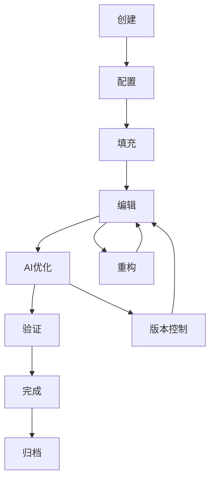

# 智能化模块化编辑器架构设计

## 概述

本文档详细描述了一个全新的智能化模块化编辑器架构，该架构基于AI驱动的智能模块概念，提供直观的拖拽式操作、实时依赖关系分析、以及深度的AI集成。

## 1. 核心理念设计

### 1.1 智能模块概念

智能模块是一个自包含的写作单元，具备以下特性：

- **自适应性**: 模块能够根据上下文自动调整内容结构和提示
- **依赖感知**: 模块了解自己与其他模块的关系，并能智能提醒依赖更新
- **内容智能**: 基于AI的内容生成、优化和一致性检查
- **进化能力**: 模块能够从用户行为中学习，不断优化模板和建议

### 1.2 模块生命周期



**生命周期阶段说明：**

1. **创建阶段**: 用户选择模块类型或使用AI推荐
2. **配置阶段**: 设置模块属性、依赖关系和目标
3. **填充阶段**: AI智能填充基础内容框架
4. **编辑阶段**: 用户编辑内容，AI实时提供建议
5. **AI优化阶段**: 自动优化语言表达、结构和一致性
6. **验证阶段**: 检查内容质量、依赖完整性和学术规范
7. **完成阶段**: 模块标记为完成，进入只读状态（可重新激活）

### 1.3 智能依赖关系

模块间的依赖关系分为四个层次：

- **结构依赖**: 基于学术论文标准结构的逻辑顺序
- **内容依赖**: 基于概念引用、数据流转的语义依赖
- **引用依赖**: 基于文献引用、图表引用的显式依赖
- **风格依赖**: 基于写作风格、术语使用的一致性依赖

## 2. 模块类型体系

### 2.1 核心模块类型

```typescript
interface IntelligentModuleType {
  id: string;
  category: ModuleCategory;
  name: string;
  description: string;
  aiCapabilities: AICapability[];
  structuralRequirements: StructuralRequirement[];
  contentPatterns: ContentPattern[];
  dependencyRules: DependencyRule[];
  adaptationStrategies: AdaptationStrategy[];
}

enum ModuleCategory {
  STRUCTURAL = 'structural',     // 结构性模块（摘要、引言等）
  ANALYTICAL = 'analytical',     // 分析性模块（文献综述、数据分析等）
  METHODOLOGICAL = 'methodological', // 方法论模块
  PRESENTATIONAL = 'presentational', // 展示性模块（图表、表格等）
  SUPPLEMENTARY = 'supplementary'    // 补充性模块（附录、参考文献等）
}
```

### 2.2 智能模块模板系统

```typescript
interface IntelligentModuleTemplate {
  id: string;
  type: IntelligentModuleType;
  name: string;
  description: string;
  
  // 结构定义
  structure: {
    sections: TemplateSection[];
    requiredElements: RequiredElement[];
    optionalElements: OptionalElement[];
  };
  
  // AI能力配置
  aiConfig: {
    contentGeneration: ContentGenerationConfig;
    styleAdaptation: StyleAdaptationConfig;
    qualityAssessment: QualityAssessmentConfig;
    suggestionEngine: SuggestionEngineConfig;
  };
  
  // 适应性规则
  adaptationRules: {
    fieldSpecific: FieldSpecificRule[];
    lengthAdaptation: LengthAdaptationRule[];
    styleAdaptation: StyleAdaptationRule[];
    audienceAdaptation: AudienceAdaptationRule[];
  };
  
  // 质量标准
  qualityStandards: {
    contentQuality: QualityMetric[];
    structuralIntegrity: StructuralMetric[];
    academicRigor: AcademicMetric[];
  };
}
```

### 2.3 动态模板推荐

系统根据以下因素动态推荐模板：

- **研究领域**: 基于用户选择的学科领域
- **论文类型**: 理论研究、实证研究、综述等
- **目标期刊**: 特定期刊的格式要求
- **用户偏好**: 基于历史使用数据的个性化推荐
- **AI分析**: 基于已有内容的智能推荐

## 3. 智能化特性

### 3.1 AI驱动的内容生成

```typescript
interface ContentGenerationEngine {
  // 上下文感知生成
  generateWithContext(
    moduleType: IntelligentModuleType,
    context: ModuleContext,
    userInput: UserInput
  ): Promise<GeneratedContent>;
  
  // 增量内容生成
  generateIncremental(
    existingContent: string,
    targetLength: number,
    style: WritingStyle
  ): Promise<string>;
  
  // 结构化内容生成
  generateStructured(
    template: StructuredTemplate,
    data: ResearchData
  ): Promise<StructuredContent>;
}

interface ModuleContext {
  precedingModules: ModuleContent[];
  researchDomain: ResearchDomain;
  writingGoals: WritingGoal[];
  targetAudience: Audience;
  academicLevel: AcademicLevel;
}
```

### 3.2 智能顺序推荐

```typescript
interface ModuleSequenceOptimizer {
  // 基于依赖分析的顺序推荐
  recommendOptimalSequence(
    modules: IntelligentModule[],
    constraints: SequenceConstraint[]
  ): ModuleSequence;
  
  // 动态重排序
  dynamicReordering(
    currentSequence: ModuleSequence,
    newModule: IntelligentModule
  ): ModuleSequence;
  
  // 并行模块识别
  identifyParallelModules(
    modules: IntelligentModule[]
  ): ParallelGroup[];
}
```

### 3.3 逻辑关系检测

```typescript
interface LogicalRelationshipDetector {
  // 自动检测模块间关系
  detectRelationships(
    modules: IntelligentModule[]
  ): ModuleRelationship[];
  
  // 一致性检查
  checkConsistency(
    modules: IntelligentModule[]
  ): ConsistencyReport;
  
  // 缺失关系提醒
  suggestMissingRelationships(
    modules: IntelligentModule[]
  ): RelationshipSuggestion[];
}
```

### 3.4 内容一致性检查

```typescript
interface ConsistencyChecker {
  // 术语一致性
  checkTerminologyConsistency(
    modules: IntelligentModule[]
  ): TerminologyReport;
  
  // 风格一致性
  checkStyleConsistency(
    modules: IntelligentModule[]
  ): StyleReport;
  
  // 引用一致性
  checkCitationConsistency(
    modules: IntelligentModule[]
  ): CitationReport;
  
  // 数据一致性
  checkDataConsistency(
    modules: IntelligentModule[]
  ): DataConsistencyReport;
}
```

## 4. 用户交互设计

### 4.1 智能拖拽系统

```typescript
interface IntelligentDragDropSystem {
  // 智能放置预测
  predictDropZones(
    draggedModule: IntelligentModule,
    targetArea: DropArea
  ): SmartDropZone[];
  
  // 依赖关系可视化
  visualizeDependencies(
    module: IntelligentModule,
    action: DragAction
  ): void;
  
  // 自动重排序建议
  suggestReordering(
    newSequence: ModuleSequence
  ): ReorderingSuggestion[];
}

interface SmartDropZone {
  zone: DropZone;
  compatibility: number; // 0-1
  impacts: DependencyImpact[];
  warnings: Warning[];
  suggestions: Suggestion[];
}
```

### 4.2 实时依赖关系可视化

```typescript
interface DependencyVisualization {
  // 动态依赖图
  renderDynamicDependencyGraph(
    modules: IntelligentModule[],
    focusModule?: string
  ): DependencyGraph;
  
  // 影响分析
  showImpactAnalysis(
    changedModule: IntelligentModule
  ): ImpactVisualization;
  
  // 路径高亮
  highlightDependencyPath(
    sourceModule: string,
    targetModule: string
  ): void;
}
```

### 4.3 智能写作进度跟踪

```typescript
interface IntelligentProgressTracker {
  // 智能进度计算
  calculateIntelligentProgress(
    modules: IntelligentModule[]
  ): ProgressMetrics;
  
  // 预测完成时间
  predictCompletionTime(
    currentProgress: ProgressMetrics,
    writingVelocity: WritingVelocity
  ): TimeEstimate;
  
  // 瓶颈识别
  identifyBottlenecks(
    modules: IntelligentModule[]
  ): Bottleneck[];
}
```

### 4.4 自适应界面布局

```typescript
interface AdaptiveUI {
  // 基于内容复杂度调整布局
  adaptLayoutToComplexity(
    modules: IntelligentModule[],
    userPreferences: UIPreferences
  ): LayoutConfiguration;
  
  // 智能面板管理
  optimizePanelArrangement(
    activeFeatures: Feature[],
    screenSize: ScreenSize
  ): PanelConfiguration;
  
  // 上下文感知工具栏
  generateContextualToolbar(
    selectedModule: IntelligentModule,
    currentAction: Action
  ): ToolbarConfiguration;
}
```

## 5. 技术架构

### 5.1 核心数据结构

```typescript
// 智能模块核心数据结构
interface IntelligentModule {
  // 基础属性
  id: string;
  type: IntelligentModuleType;
  name: string;
  description: string;
  
  // 内容数据
  content: {
    raw: string;
    structured: StructuredContent;
    metadata: ContentMetadata;
    versions: ContentVersion[];
  };
  
  // 智能属性
  intelligence: {
    aiGenerated: boolean;
    confidence: number;
    suggestions: AISuggestion[];
    learningData: LearningData;
  };
  
  // 依赖关系
  dependencies: {
    structural: StructuralDependency[];
    semantic: SemanticDependency[];
    citation: CitationDependency[];
    data: DataDependency[];
  };
  
  // 状态管理
  state: {
    lifecycle: LifecycleStage;
    progress: ProgressState;
    quality: QualityState;
    validation: ValidationState;
  };
  
  // 配置选项
  configuration: {
    template: IntelligentModuleTemplate;
    aiSettings: AISettings;
    userPreferences: UserPreferences;
  };
}

// 模块依赖关系
interface ModuleDependency {
  id: string;
  sourceModuleId: string;
  targetModuleId: string;
  type: DependencyType;
  strength: number; // 0-1, 依赖强度
  bidirectional: boolean;
  
  // 智能属性
  autoDetected: boolean;
  confidence: number;
  impactAnalysis: ImpactAnalysis;
  
  // 验证状态
  isValid: boolean;
  validationErrors: ValidationError[];
  lastValidated: Date;
}
```

### 5.2 组件架构设计

```typescript
// 主编辑器组件架构
interface EditorArchitecture {
  // 核心编辑器
  coreEditor: {
    component: IntelligentModularEditor;
    responsibilities: [
      'Module lifecycle management',
      'User interaction handling',
      'State orchestration'
    ];
  };
  
  // 智能引擎
  intelligenceEngine: {
    contentGenerator: ContentGenerationEngine;
    dependencyAnalyzer: DependencyAnalyzer;
    qualityAssessor: QualityAssessmentEngine;
    suggestionEngine: SuggestionEngine;
  };
  
  // 用户界面层
  uiLayer: {
    moduleCanvas: ModuleCanvas;
    dependencyVisualizer: DependencyVisualizer;
    intelligencePanel: IntelligencePanel;
    progressTracker: IntelligentProgressTracker;
  };
  
  // 数据管理层
  dataLayer: {
    moduleStore: ModuleStateManager;
    aiCache: AIResponseCache;
    userPreferences: PreferenceManager;
    versionControl: VersionControlSystem;
  };
}
```

### 5.3 状态管理方案

```typescript
// 使用 Zustand + Immer 的状态管理
interface EditorState {
  // 模块数据
  modules: Map<string, IntelligentModule>;
  
  // 依赖关系
  dependencies: Map<string, ModuleDependency>;
  
  // UI状态
  ui: {
    selectedModules: Set<string>;
    activePanel: PanelType;
    layoutMode: LayoutMode;
    viewSettings: ViewSettings;
  };
  
  // AI状态
  ai: {
    isProcessing: boolean;
    suggestions: Map<string, AISuggestion[]>;
    analysisResults: Map<string, AnalysisResult>;
    learningData: LearningData;
  };
  
  // 用户状态
  user: {
    preferences: UserPreferences;
    workingContext: WorkingContext;
    sessionHistory: SessionAction[];
  };
}

// 状态管理操作
interface EditorActions {
  // 模块操作
  modules: {
    create: (type: IntelligentModuleType, config?: ModuleConfig) => void;
    update: (id: string, updates: Partial<IntelligentModule>) => void;
    delete: (id: string) => void;
    reorder: (sequence: string[]) => void;
  };
  
  // AI操作
  ai: {
    generateContent: (moduleId: string, prompt: GenerationPrompt) => Promise<void>;
    applySuggestion: (suggestionId: string) => void;
    dismissSuggestion: (suggestionId: string) => void;
    analyzeContent: (moduleId: string) => Promise<void>;
  };
  
  // 依赖操作
  dependencies: {
    create: (dependency: DependencyInput) => void;
    update: (id: string, updates: Partial<ModuleDependency>) => void;
    delete: (id: string) => void;
    validate: (id: string) => Promise<ValidationResult>;
  };
}
```

### 5.4 AI服务集成方案

```typescript
// AI服务抽象接口
interface AIServiceProvider {
  // 内容生成
  generateContent(request: ContentGenerationRequest): Promise<GeneratedContent>;
  
  // 内容分析
  analyzeContent(content: string): Promise<ContentAnalysis>;
  
  // 建议生成
  generateSuggestions(context: SuggestionContext): Promise<AISuggestion[]>;
  
  // 质量评估
  assessQuality(content: string, criteria: QualityCriteria): Promise<QualityScore>;
}

// 多AI服务编排
interface AIOrchestrator {
  // 服务选择策略
  selectBestService(task: AITask): AIServiceProvider;
  
  // 结果融合
  mergeResults(results: AIResult[]): AIResult;
  
  // 性能监控
  monitorPerformance(): PerformanceMetrics;
  
  // 错误处理
  handleServiceError(error: ServiceError): FallbackStrategy;
}
```

## 6. 扩展性考虑

### 6.1 插件化模块系统

```typescript
// 模块插件接口
interface ModulePlugin {
  id: string;
  name: string;
  version: string;
  
  // 插件能力
  capabilities: {
    moduleTypes: IntelligentModuleType[];
    aiEnhancements: AIEnhancement[];
    uiComponents: UIComponent[];
    dataProcessors: DataProcessor[];
  };
  
  // 生命周期钩子
  hooks: {
    onModuleCreate?: (module: IntelligentModule) => void;
    onModuleUpdate?: (module: IntelligentModule, changes: ModuleChanges) => void;
    onModuleDelete?: (moduleId: string) => void;
    onDependencyChange?: (dependency: ModuleDependency) => void;
  };
  
  // 配置选项
  configuration: PluginConfiguration;
}

// 插件管理器
interface PluginManager {
  // 插件注册
  registerPlugin(plugin: ModulePlugin): Promise<void>;
  
  // 插件卸载
  unregisterPlugin(pluginId: string): Promise<void>;
  
  // 插件通信
  communicateWithPlugin(pluginId: string, message: PluginMessage): Promise<PluginResponse>;
  
  // 插件更新
  updatePlugin(pluginId: string, newVersion: string): Promise<void>;
}
```

### 6.2 可定制的模块模板

```typescript
// 模板定制接口
interface TemplateCustomizer {
  // 创建自定义模板
  createCustomTemplate(
    baseTemplate: IntelligentModuleTemplate,
    customizations: TemplateCustomization[]
  ): IntelligentModuleTemplate;
  
  // 模板验证
  validateTemplate(template: IntelligentModuleTemplate): ValidationResult;
  
  // 模板导入导出
  exportTemplate(template: IntelligentModuleTemplate): SerializedTemplate;
  importTemplate(data: SerializedTemplate): IntelligentModuleTemplate;
  
  // 模板共享
  shareTemplate(template: IntelligentModuleTemplate): ShareableTemplate;
  installSharedTemplate(shareableTemplate: ShareableTemplate): Promise<void>;
}
```

### 6.3 开放API接口

```typescript
// 编辑器API接口
interface EditorAPI {
  // 模块操作API
  modules: {
    create(type: string, config?: any): Promise<string>;
    read(id: string): Promise<IntelligentModule>;
    update(id: string, updates: any): Promise<void>;
    delete(id: string): Promise<void>;
    list(filter?: ModuleFilter): Promise<IntelligentModule[]>;
  };
  
  // AI服务API
  ai: {
    generateContent(moduleId: string, prompt: string): Promise<string>;
    analyzeDependencies(): Promise<DependencyAnalysis>;
    getSuggestions(moduleId: string): Promise<AISuggestion[]>;
    assessQuality(moduleId: string): Promise<QualityAssessment>;
  };
  
  // 事件API
  events: {
    subscribe(event: string, callback: EventCallback): void;
    unsubscribe(event: string, callback: EventCallback): void;
    emit(event: string, data: any): void;
  };
  
  // 配置API
  configuration: {
    getUserPreferences(): Promise<UserPreferences>;
    updateUserPreferences(preferences: Partial<UserPreferences>): Promise<void>;
    getAISettings(): Promise<AISettings>;
    updateAISettings(settings: Partial<AISettings>): Promise<void>;
  };
}
```

## 7. 实现方案

### 7.1 技术栈选择

- **前端框架**: React 18 + TypeScript
- **状态管理**: Zustand + Immer
- **UI组件**: Tailwind CSS + Headless UI
- **拖拽系统**: @dnd-kit
- **图形可视化**: D3.js + React Flow
- **AI集成**: OpenAI API + 本地AI模型
- **数据持久化**: IndexedDB + 云同步
- **构建工具**: Vite + ESBuild

### 7.2 开发阶段规划

**阶段一：核心基础 (4周)**
- 智能模块数据结构设计
- 基础编辑器界面实现
- 简单拖拽功能实现
- 基础AI服务集成

**阶段二：智能特性 (6周)**
- AI内容生成引擎
- 依赖关系分析器
- 智能建议系统
- 内容一致性检查

**阶段三：交互优化 (4周)**
- 高级拖拽系统
- 依赖关系可视化
- 自适应界面布局
- 性能优化

**阶段四：扩展功能 (4周)**
- 插件系统实现
- 模板定制功能
- API接口开发
- 测试与优化

### 7.3 性能优化策略

- **虚拟滚动**: 处理大量模块时的性能
- **增量更新**: 只更新变化的模块
- **智能缓存**: AI响应和分析结果缓存
- **异步处理**: 非阻塞的AI计算
- **代码分割**: 按需加载功能模块

## 8. 总结

本智能化模块化编辑器架构提供了一个完整、可扩展的解决方案，具备以下核心优势：

1. **智能化**: 深度AI集成，提供智能内容生成、分析和建议
2. **模块化**: 灵活的模块系统，支持自定义和扩展
3. **直观性**: 拖拽式操作，可视化依赖关系
4. **自适应**: 根据用户行为和内容特点自动调整
5. **扩展性**: 插件化架构，支持第三方扩展

该架构为学术写作提供了一个强大、智能、用户友好的解决方案，能够显著提高写作效率和质量。