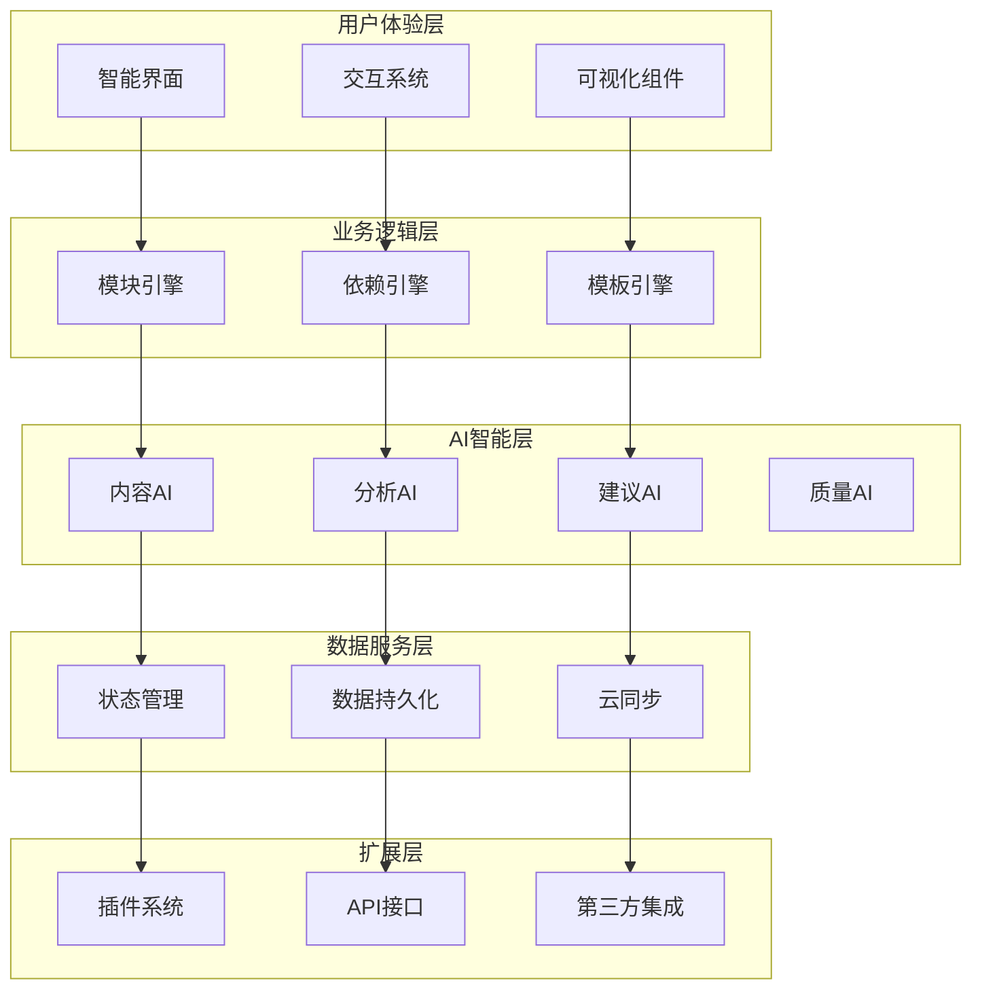

# 智能化模块化编辑器架构设计 - 总览

## 文档索引

本系列文档提供了智能化模块化编辑器的完整架构设计，包含概念设计、技术实现和开发指南。

### 📋 文档结构

| 文档 | 内容描述 | 关键内容 |
|------|----------|----------|
| [架构设计总览](./INTELLIGENT_MODULAR_EDITOR_ARCHITECTURE.md) | 完整的架构设计文档 | 核心理念、模块体系、智能特性、技术架构 |
| [概念图与数据结构](./INTELLIGENT_EDITOR_CONCEPTS.md) | 系统概念图和数据模型 | 概念图、数据结构、数据流图 |
| [组件设计与实现](./INTELLIGENT_EDITOR_IMPLEMENTATION.md) | 组件架构和实现方案 | 组件设计、代码示例、实现策略 |

## 🎯 核心设计理念

### 智能模块概念
- **自适应性**: 模块根据上下文自动调整
- **依赖感知**: 智能识别和管理模块关系
- **内容智能**: AI驱动的内容生成和优化
- **进化能力**: 从用户行为中学习改进

### 四层依赖关系
- **结构依赖**: 基于学术论文标准结构
- **内容依赖**: 基于概念引用和语义关系
- **引用依赖**: 基于文献和图表引用
- **风格依赖**: 基于写作风格一致性

## 🏗️ 架构概览



## 🧩 核心组件

### 主要组件列表

| 组件名称 | 功能描述 | 智能特性 |
|----------|----------|----------|
| `IntelligentModularEditor` | 主编辑器，统筹全局 | 自适应布局、智能推荐 |
| `IntelligentModuleCard` | 智能模块卡片 | AI内容生成、实时建议 |
| `SmartDragDropSystem` | 智能拖拽系统 | 智能放置预测、约束检查 |
| `DependencyVisualizer` | 依赖关系可视化 | 自动布局、关系预测 |
| `AIIntelligencePanel` | AI智能面板 | 多模型协调、结果融合 |
| `SmartTemplateLibrary` | 智能模板库 | 智能推荐、自适应模板 |

### 核心数据结构

```typescript
// 智能模块核心结构
interface IntelligentModule {
  // 基础信息
  id: string;
  type: IntelligentModuleType;
  name: string;
  
  // 内容数据
  content: {
    raw: string;
    structured: StructuredContent;
    metadata: ContentMetadata;
    versions: ContentVersion[];
  };
  
  // 智能属性
  intelligence: {
    aiGenerated: boolean;
    confidence: number;
    suggestions: AISuggestion[];
    learningData: LearningData;
  };
  
  // 依赖关系
  dependencies: {
    structural: StructuralDependency[];
    semantic: SemanticDependency[];
    citation: CitationDependency[];
    data: DataDependency[];
  };
  
  // 状态和配置
  state: ModuleState;
  configuration: ModuleConfiguration;
}
```

## 🤖 AI智能特性

### 内容生成引擎
- **上下文感知生成**: 基于模块类型和文档上下文
- **增量内容生成**: 在现有内容基础上扩展
- **结构化内容生成**: 基于模板的结构化内容

### 智能建议系统
- **实时内容建议**: 编辑过程中的即时建议
- **结构优化建议**: 文档结构改进建议
- **风格一致性建议**: 保持写作风格统一

### 质量评估
- **多维度质量评分**: 内容、结构、清晰度等
- **问题识别**: 语法、风格、结构问题检测
- **改进建议**: 具体可操作的改进建议

## 🎮 交互设计

### 智能拖拽
- **智能放置预测**: 预测最佳放置位置
- **兼容性检查**: 实时验证模块兼容性
- **依赖关系预览**: 拖拽时显示依赖影响

### 依赖关系可视化
- **动态依赖图**: 实时更新的依赖关系网络
- **交互式探索**: 点击、悬停查看详细信息
- **路径高亮**: 突出显示依赖路径

### 自适应界面
- **基于内容的布局**: 根据内容复杂度调整界面
- **智能面板管理**: 自动调整面板大小和位置
- **上下文工具栏**: 根据选中内容显示相关工具

## 🔧 技术实现

### 技术栈
- **前端**: React 18 + TypeScript + Tailwind CSS
- **状态管理**: Zustand + Immer
- **拖拽系统**: @dnd-kit
- **可视化**: D3.js + React Flow
- **AI集成**: OpenAI API + 多AI服务编排
- **构建工具**: Vite + ESBuild

### 性能优化
- **虚拟滚动**: 处理大量模块
- **智能缓存**: AI响应和分析结果缓存
- **增量更新**: 只更新变化的部分
- **异步处理**: 非阻塞的AI计算

### 扩展机制
- **插件系统**: 支持第三方功能扩展
- **模板定制**: 可定制的模块模板
- **开放API**: 支持外部集成

## 📈 开发计划

### 阶段规划

| 阶段 | 时间 | 主要目标 | 关键交付物 |
|------|------|----------|------------|
| 阶段一 | 4周 | 核心基础建设 | 数据结构、基础组件、简单拖拽 |
| 阶段二 | 6周 | 智能特性实现 | AI集成、内容生成、建议系统 |
| 阶段三 | 4周 | 交互优化 | 高级拖拽、可视化、自适应界面 |
| 阶段四 | 4周 | 扩展功能 | 插件系统、API接口、测试优化 |

### 关键里程碑

1. **MVP版本** (第4周): 基础模块编辑功能
2. **Alpha版本** (第10周): 完整AI功能集成
3. **Beta版本** (第14周): 高级交互特性
4. **Release版本** (第18周): 完整功能和扩展支持

## 🎯 预期收益

### 用户体验提升
- **写作效率提升50%**: 通过AI辅助和智能模板
- **内容质量提升30%**: 通过实时建议和质量评估
- **学习曲线降低60%**: 通过直观的拖拽操作和智能引导

### 技术创新点
- **多层次依赖关系建模**: 业界首创的四层依赖模型
- **AI驱动的内容优化**: 实时、上下文感知的内容改进
- **智能模块生态系统**: 可扩展、可定制的模块架构

### 商业价值
- **提高用户留存**: 通过智能化功能增强用户粘性
- **降低技术门槛**: 让非专业用户也能写出高质量论文
- **构建生态系统**: 通过插件和API吸引开发者社区

## 📚 使用指南

### 快速开始
1. 阅读 [架构设计总览](./INTELLIGENT_MODULAR_EDITOR_ARCHITECTURE.md) 了解整体设计
2. 查看 [概念图与数据结构](./INTELLIGENT_EDITOR_CONCEPTS.md) 理解核心概念
3. 参考 [组件设计与实现](./INTELLIGENT_EDITOR_IMPLEMENTATION.md) 开始开发

### 开发建议
- **循序渐进**: 按照阶段规划逐步实现功能
- **测试先行**: 为每个组件编写单元测试
- **性能监控**: 持续监控和优化性能指标
- **用户反馈**: 及时收集和响应用户反馈

## 🔮 未来展望

### 短期规划 (6个月)
- 完成核心功能开发
- 发布Beta版本
- 收集用户反馈并迭代

### 中期规划 (1年)
- 完善插件生态
- 支持多语言
- 移动端适配

### 长期规划 (2年)
- AI能力升级到GPT-5级别
- 支持多人实时协作
- 构建完整的学术写作生态系统

---

*本架构设计文档将随着项目发展持续更新和完善。*